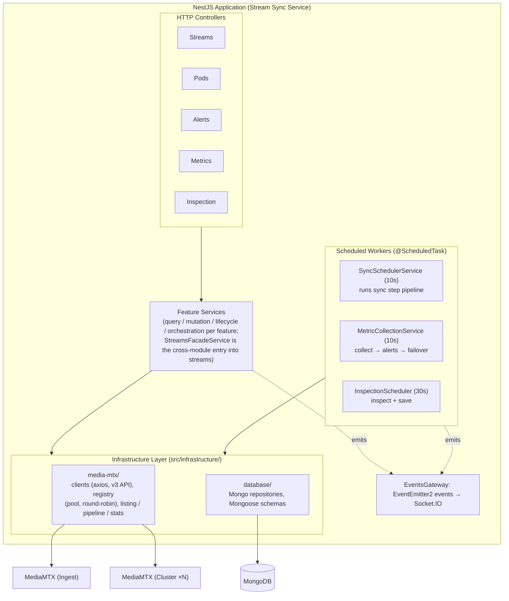
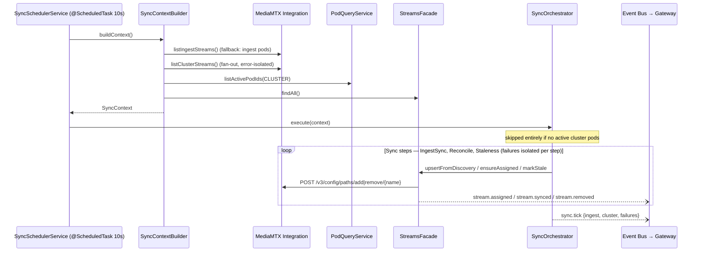
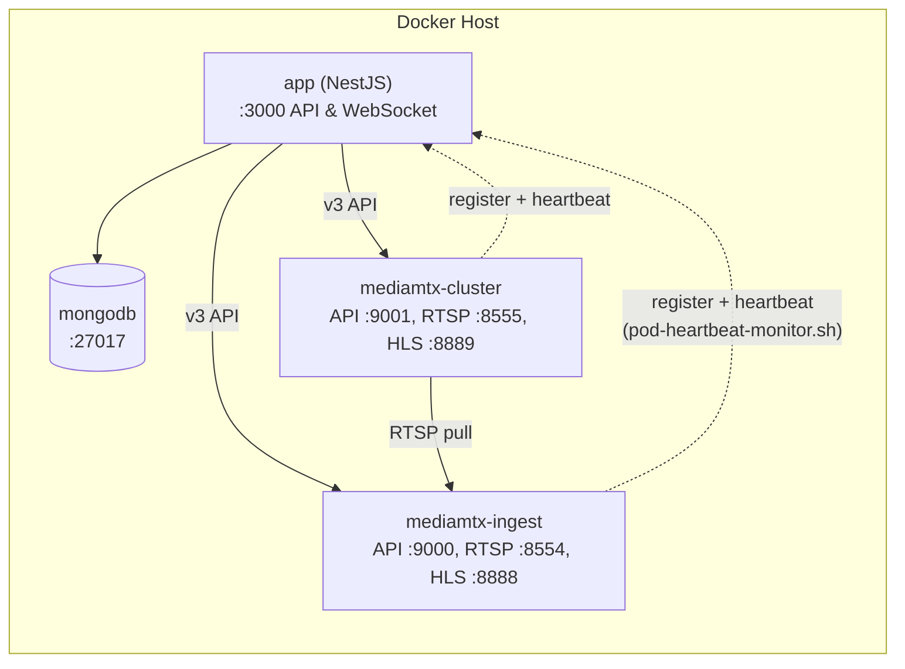
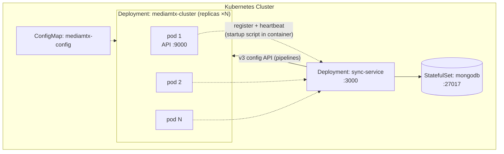
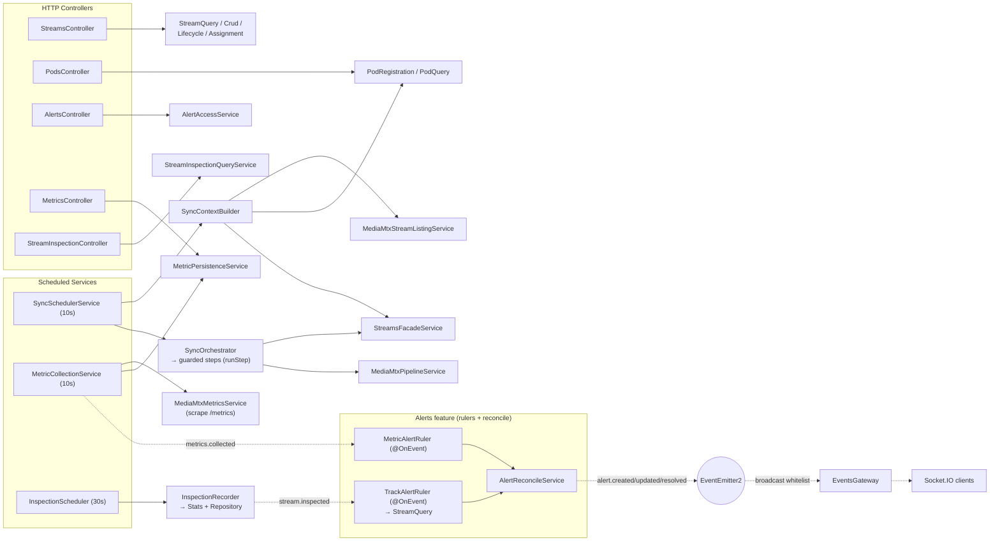
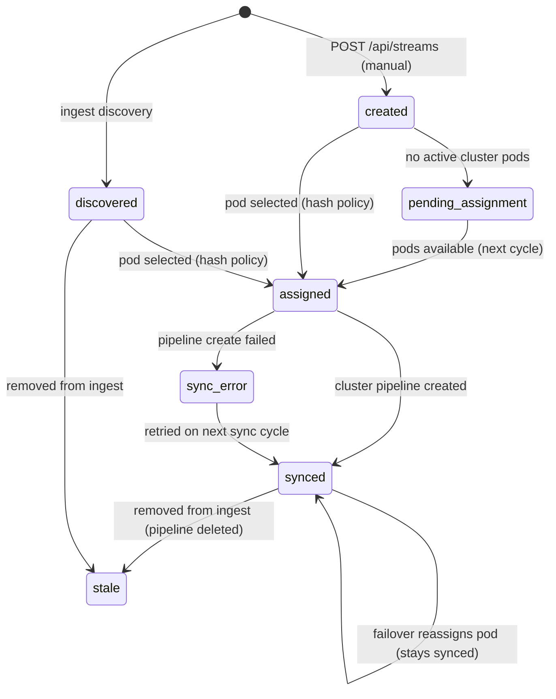

# System Documentation - MediaMTX Stream Sync

## Table of Contents

1. [System Overview](#system-overview)
2. [Architecture](#architecture)
3. [Module Design](#module-design)
4. [Data Flow](#data-flow)
5. [Deployment Architecture](#deployment-architecture)
6. [Database Schema](#database-schema)
7. [Service Integration](#service-integration)
8. [Operational Patterns](#operational-patterns)
9. [Known Limitations](#known-limitations)
10. [Development Guide](#development-guide)

---

## System Overview

**MediaMTX Stream Sync** is a distributed streaming orchestration platform built on NestJS that manages the lifecycle of media streams across multiple MediaMTX nodes.

### Core Purpose

The system solves the problem of coordinating media stream ingestion and distribution across a cluster:

1. **Dynamic Discovery**: Automatically discovers streams from the ingest MediaMTX node (with fallback to registered ingest pods)
2. **Distribution**: Creates pull pipelines for discovered streams on cluster nodes
3. **Load Balancing**: Uses a deterministic hash policy to assign streams across active cluster pods
4. **Monitoring**: Continuously collects metrics and raises threshold-based alerts
5. **Failover**: Reassigns degraded cluster streams to a different active pod
6. **Analysis**: Inspects media tracks at regular intervals for missing or unexpected content
7. **Real-time Awareness**: Broadcasts state changes to connected clients via WebSocket

### Technology Stack

- **Framework**: NestJS 9.x with TypeScript (strict layering, barrel exports via barrelsby)
- **Database**: MongoDB via Mongoose ODM (repository pattern; Mongo implementations in `infrastructure/`)
- **Real-time**: Socket.IO for WebSocket events
- **Scheduling**: a central `JobScheduler` (`src/common/scheduling/`) runs `@ScheduledTask`-decorated methods on config-driven intervals
- **Eventing**: @nestjs/event-emitter (in-process event bus, bridged to WebSocket by the gateway)
- **HTTP Clients**: Axios clients wrapping the MediaMTX v3 HTTP API

### Deployment Models

- **Docker Compose** (`deploy/docker/compose.local.yml`): Local development and single-machine deployments
- **Docker Compose Scale** (+ `deploy/docker/compose.cluster.yml` override): Multi-instance cluster with automatic pod registration
- **Kubernetes**: Production deployments with health probes and automatic restarts

---

## Architecture

### High-Level System Diagram

A navigable LikeC4 version of this model lives in `docs/architecture/` (repo root) — see ADR-0006.



### Module Layout

```
src/
├── app.module.ts                 # Root module
├── main.ts                       # Bootstrap (ValidationPipe, Swagger at /api/docs)
├── config/                       # ConfigService (env var access)
├── common/                       # Shared domain + cross-cutting services
│   ├── domain/
│   │   ├── consts/               # system-event-names.const.ts
│   │   ├── enums/                # AlertSeverity, AlertType, PodRole, PodStatus,
│   │   │                         #   StreamStatus, TrackType
│   │   └── types/                # event payloads, alert rule shapes, StreamTrack
│   ├── rules/                    # metric-threshold predicate utils
│   └── scheduling/               # JobScheduler + @ScheduledTask (cron framework)
├── infrastructure/
│   ├── database/
│   │   ├── repositories/         # mongo-*.repository.ts (concrete implementations)
│   │   └── schemas/              # Mongoose schemas (pod, stream, alert, metric,
│   │                             #   stream-inspection)
│   └── media-mtx/
│       ├── clients/              # MediaMtxClient (axios wrapper, v3 paths API)
│       ├── registry/             # client factory (cached) + registry (round-robin)
│       ├── mappers/              # v3 → domain mappers + TRACK_FIELD_MAP table
│       ├── services/
│       │   ├── listing/          # ingest/cluster listing strategies + fan-out
│       │   ├── pipeline/         # MediaMtxPipelineService (create/delete paths)
│       │   └── stats/            # MediaMtxStreamStatsService
│       └── types/                # V3PathItem, StreamStats, etc.
├── pods/
│   ├── controllers/              # POST register/heartbeat, GET /, GET /active
│   ├── domain/types/
│   ├── dto/                      # RegisterPodDto, HeartbeatDto
│   ├── repositories/             # PodRepository (abstract contract)
│   └── services/                 # query/ (PodQueryService), lifecycle/ (PodLifecycleService)
├── streams/
│   ├── controllers/
│   ├── domain/types/
│   ├── dto/                      # CreateStreamDto, UpdateStreamDto, AssignStreamDto
│   ├── repositories/             # StreamRepository (abstract contract)
│   └── services/
│       ├── assignment/           # StreamAssignmentPolicy (abstract) + assignment service;
│       │                         #   hash/ variant folder (HashStreamAssignmentPolicy)
│       ├── mutation/             # StreamCrudService, StreamStatusService
│       ├── orchestration/        # StreamSetupService, StreamPipelineService
│       ├── query/                # StreamQueryService
│       └── streams-facade.service.ts  # public entry point for other modules
├── alerts/
│   ├── controllers/
│   ├── domain/
│   │   ├── consts/               # METRIC_ALERT_RULES, STREAM_TRACK_ALERT_RULES
│   │   └── types/                # Alert, rule + context types
│   ├── repositories/             # AlertRepository (abstract contract)
│   └── services/                 # AlertReconcileService, AlertAccessService
│       └── rulers/               #   MetricAlertRuler, TrackAlertRuler, NodeResourceRuler (@OnEvent)
├── metrics/                      # MediaMTX operational metrics (no rules/alerts)
│   ├── controllers/
│   ├── domain/types/             # NodeMetric, PathMetric
│   ├── repositories/             # NodeMetricRepository, PathMetricRepository
│   └── services/
│       ├── collection/           # scheduler: scrape → persist → emit metrics.collected
│       └── persistence/          # MetricPersistenceService (node + path)
├── stream-inspection/            # emits stream.inspected; no alert logic
│   ├── controllers/
│   ├── domain/types/             # StreamInspectionRecord
│   ├── repositories/             # StreamInspectionRepository (abstract contract)
│   └── services/
│       ├── query/                # StreamInspectionQueryService
│       └── collection/           # StreamInspectionCollectionService (@ScheduledTask 30s; sweep → inspect → record → emit)
├── sync/
│   ├── domain/                   # SyncContext / SyncDiscoveredStream types
│   └── services/
│       ├── scheduler/            # SyncSchedulerService (@ScheduledTask 10s)
│       ├── context/              # SyncContextBuilderService (builds SyncContext)
│       ├── orchestration/        # SyncOrchestratorService (runs each step via a guarded runStep)
│       └── workflows/            # IngestStreamSynchronizer, StreamReconcile,
│                                 #   StreamStaleness (+ discovery helper)
└── gateway/                      # EventsGateway (Socket.IO broadcast)
```

Every folder has a barrelsby-generated `index.ts`; imports between features go through `@/<feature>` path aliases.

---

## Module Design

### Pods Module

**Responsibility**: Pod registration, heartbeats, and active-pod queries.

**Services**:

- `PodLifecycleService.registerPod(data)`: Upsert by `podId`, set status `active`, refresh `lastHeartbeatAt`, write `host` + `type` (both required), emit `pod.registered`
- `PodLifecycleService.heartbeat(podId)`: Refresh heartbeat only (no `pod.registered`)
- Both register/heartbeat accept optional `resources` (CPU/memory/disk %); when present, emit `node.sampled` for the alerts `NodeResourceRuler` (the pods feature is a node-alert producer)
- `PodQueryService.getActivePods(role?)`: Pods with a heartbeat within `POD_HEALTH_TOLERANCE_SECONDS`
- `PodQueryService.listActivePodRefs(role?)` / `listActivePodIds(role?)`: Lightweight projections used by sync/metrics/infrastructure

**Used By**:

- `IngestStreamListingStrategy`: To discover ingest pods when the primary ingest endpoint fails
- `SyncContextBuilderService`: To select active cluster pod IDs for assignment
- `StreamFailoverService` / `StreamSetupService`: To pick failover/assignment candidates

---

### Streams Module

**Responsibility**: Stream metadata, status transitions, pod assignment, and pipeline provisioning.

Internally split by service role; `StreamsFacadeService` is the single entry point other modules (sync, metrics) use.

**Services**:

- `StreamQueryService` (read): `findAll`, `findByName`, `findRequiredByName`, `findAssignedByName`, `getAssignmentInfo`
- `StreamCrudService` (mutation): `create`, `update`, `patch`, `remove`
- `StreamStatusService` (mutation): `upsertFromDiscovery`, `markStale`
- `StreamAssignmentService` (mutation): `assignToPod` (emits `stream.assigned`), `clearAssignment` (emits `stream.unassigned`), `ensureAssigned`, `reassign`
- `StreamSetupService` (orchestration): `create` → assign → provision; marks `pending_assignment` if no active cluster pods
- `StreamPipelineService` (orchestration): creates the cluster pull pipeline, sets `synced`/`sync_error`, emits `stream.synced`
- `StreamsFacadeService`: thin facade re-exposing the above for cross-module callers

**Assignment Policy**:

- `StreamAssignmentPolicy` is an abstract class used as a DI token
- `HashStreamAssignmentPolicy` implements it: djb2-style hash of the stream name modulo the candidate pod count — deterministic as long as pod list order is stable

---

### Alerts Module

**Responsibility**: Own the rule sets, evaluate producer data into alerts, and run the alert lifecycle (ADR-0010).

**Rulers** (event listeners that evaluate rules → signals → reconcile):

- `MetricAlertRuler` (`@OnEvent metrics.collected`): runs `METRIC_ALERT_RULES` over every path sample → per-stream signals → `reconcileSource(metrics, …)`
- `TrackAlertRuler` (`@OnEvent stream.inspected`): runs `STREAM_TRACK_ALERT_RULES` over the inspected tracks (with the stream's expectations as context) → `reconcileSubject(inspection, stream, …)`
- `NodeResourceRuler` (`@OnEvent node.sampled`): runs `NODE_RESOURCE_RULES` over a pod's reported CPU/memory/disk (thresholds from config) → `reconcileSubject(node, podId, …)`

An alert's **subject** is whatever the source alerts on — a stream name (metrics/inspection) or a pod id (node). Reconcile is scoped by `(source, subject, type)`.

**Reconcile** (`AlertReconcileService`, scoped by `AlertSource`): diffs current signals against open alerts of that source — add (`alert.created`), refresh (`lastSeenAt`), update (`alert.updated`), resolve (`alert.resolved`). `reconcileSource` auto-resolves subjects absent from a cycle; duplicate-type signals (same stream on multiple nodes) collapse to one. Add is an **atomic, idempotent upsert** on the `(source, subject, type)` dedup key, backed by a partial unique index (open alerts only), so concurrent reconciles for the same subject can't create duplicates and only the inserting one emits `alert.created`.

**Read/manual surface** (`AlertAccessService`): `listAlerts`, `resolveAlert(id)` — the externally-triggered (REST) surface, distinct from the automatic reconcile lifecycle.

**Rule sets** (`alerts/domain/consts/`, evaluated via the shared `RuleEvaluator`):

- `METRIC_ALERT_RULES`: `stream_not_ready` (path not ready, warning), `frames_in_error` (frames-in-error > 0, warning)
- `STREAM_TRACK_ALERT_RULES`: missing video/audio track (warning, unless `metadata.hasExpectedVideo/Audio === false`), unexpected track types (info)

---

### Metrics Module

**Responsibility**: Monitor MediaMTX-as-a-service — scrape node + path operational metrics and emit them. No rules, no alerts, no failover (those moved out; per-stream quality is the inspection feature's job).

**Flow** (`MetricCollectionService.collectMetrics`, `@ScheduledTask` every 10 seconds):

1. `MediaMtxMetricsService.collect()` scrapes every ingest + cluster node's Prometheus `/metrics` (nodes resolved from the live pod registry, fallback to configured URLs; per-node failures isolated) → `MediaMtxMetricsSnapshot[]` (a `NodeMetric` + `PathMetric[]` per node)
2. Persist all node + path samples (`MetricPersistenceService` → `nodemetrics` / `pathmetrics`)
3. Emit `metrics.collected` `{ nodes, paths, collectedAt }` — the alerts `MetricAlertRuler` consumes it

**Failover**: removed from this feature. Pod-death reassignment in the sync loop (`ensureAssigned` dropping a vanished pod) is the failover mechanism that has real data.

---

### Sync Module

**Responsibility**: Core orchestration — discovery, assignment, pipeline creation, staleness cleanup.

**Flow** (`SyncSchedulerService.periodicSync`, `@ScheduledTask` every 10 seconds):

1. `SyncContextBuilderService.buildContext()` gathers in parallel: ingest stream list, cluster stream list, active cluster pod IDs, all DB streams → `SyncContext`
2. `SyncOrchestratorService.execute(context)`:
   - Skips entirely (with a warning) if no active cluster pods are registered
   - Runs each step service in a fixed order, isolating failures per step behind a private `runStep` guard (a failing step is logged by name and collected, without aborting the others)
   - Emits `sync.tick` with `{ ingest, cluster, failures }`

**Steps** (injected directly by the orchestrator and run in this order):

- `IngestStreamSynchronizerService`: For each discovered ingest stream — upsert into DB (`IngestStreamDiscoveryService`), ensure pod assignment, and deploy a cluster pipeline if the stream is missing from the cluster
- `StreamReconcileService`: For enabled manual streams (`isManual`) — ensure assignment and recreate missing cluster pipelines
- `StreamStalenessService`: For non-manual DB streams no longer present on ingest — mark `stale` and, when present in the cluster, tear down the pipeline via `StreamsFacadeService.teardownClusterPipeline` (streams owns the `deleteClusterPipeline` call and the `stream.removed` event)

---

### Stream Inspection Module

**Responsibility**: Analyze media tracks and raise content alerts.

**Flow** (`StreamInspectionCollectionService.inspectAllStreams`, `@ScheduledTask` every 30 seconds):

1. List all contextual streams (ingest + cluster)
2. For each, `inspectAndRecord` (same service, isolated per stream):
   - Fetch `/v3/paths/get/{name}` details (errors recorded in `lastError`, inspection still persisted)
   - Track parsing happens inside infrastructure: `getStreamDetails` returns a domain `StreamDetails` (tracks mapped via the `TRACK_FIELD_MAP` table in `infrastructure/media-mtx/mappers/`); the service assembles the record inline, defaulting to empty tracks/metadata when inspection failed
   - Persist the inspection record and emit `stream.inspected` (the service assembles the record inline)
3. Alerting is decoupled: inspection just emits the event. The alerts feature's `TrackAlertRuler` reacts (see Alerts Module / ADR-0010) — inspection no longer imports `@/alerts` or `@/streams`.

**Query API**: `StreamInspectionQueryService` provides latest-per-stream, latest-for-one, and history.

---

### MediaMTX Infrastructure (`src/infrastructure/media-mtx/`)

**Responsibility**: All HTTP communication with MediaMTX nodes, using the real **v3 API**.

**Layers**:

- `MediaMtxClient` (client): thin axios wrapper per endpoint URL (8s timeout) —
  `listPaths()` → `GET /v3/paths/list`, `getPathItem(name)` → `GET /v3/paths/get/{name}`,
  `addPath(name, source)` → `POST /v3/config/paths/add/{name}`, `removePath(name)` → `DELETE /v3/config/paths/delete/{name}`.
  Raw `V3PathItem`s are mapped to domain shapes (`mapV3PathToStream`) before leaving the client. No error handling — errors propagate.
- `MediaMtxClientFactory` (registry): creates and **caches** one client per base URL
- `MediaMtxClientRegistry` (registry): owns the ingest client and the *static* cluster pool (fallback); builds per-pod clients at `http://{host||podId}:{INGEST_POD_MEDIAMTX_PORT | CLUSTER_POD_MEDIAMTX_PORT}`
- `ClusterNodeResolverService` (registry): resolves the **live** cluster client set from the pod registry — all active cluster pods for fan-out, or the client for a specific assigned pod — falling back to the static pool / round-robin pick when none are registered (see ADR-0009)
- `MediaMtxStreamListingService` (service): ingest listing (primary endpoint with fallback to registered ingest pods) and cluster listing (fan-out over all registered cluster nodes with per-node error isolation via `StreamCollectionService`)
- `MediaMtxPipelineService` (service): create a cluster pull pipeline **on the pod the stream is assigned to**, pulling from `${INGEST_RTSP_URL}/{name}` (or the stream's stored source when it is already a pullable protocol URL; treats HTTP 409 as already-exists); delete fans out across all active cluster nodes
- `MediaMtxStreamStatsService` (service): `getStreamDetails(name, source)` — returns a domain `StreamDetails`, node selected by pod role (used by inspection)
- `MediaMtxMetricsService` (service): scrapes each node's Prometheus `/metrics` (`MediaMtxMetricsClient` → `parsePrometheusText` → `mapMetricsToSnapshot`), resolving nodes from the pod registry; returns `MediaMtxMetricsSnapshot[]`

---

### Database Infrastructure (`src/infrastructure/database/`)

Each feature defines an **abstract repository contract** in its own `repositories/` folder (e.g. `StreamRepository`); the concrete Mongoose implementations (`mongo-stream.repository.ts`, etc.) and schemas live in `infrastructure/database/`. Services depend only on the abstractions.

---

### Gateway (WebSocket)

**Responsibility**: Bridge in-process events to Socket.IO clients (`EventsGateway`, CORS open).

**Broadcast events** (subscribed at module init):

`stream.synced`, `stream.removed`, `stream.assigned`, `stream.unassigned`, `alert.created`, `alert.resolved`, `stream.inspected`, `pod.registered`

**Not forwarded**: `sync.tick` (internal diagnostics only).

---

## Data Flow

### Typical Stream Lifecycle

```
1. POD REGISTRATION
   MediaMTX pod ──POST /api/pods/register──▶ PodLifecycleService
        └─▶ upsert Pod in MongoDB ──▶ emit pod.registered ──▶ Gateway ──▶ clients
   (subsequent POST /api/pods/heartbeat refreshes lastHeartbeatAt, no event)
```

2\. STREAM SYNC (every 10 seconds):



```
3. METRICS COLLECTION (every 10 seconds)
   MetricCollectionService
     └─▶ MediaMtxMetricsService.collect()
           └─ per node (ingest + cluster, resolved from pod registry):
                GET /metrics → parse → NodeMetric + PathMetric[]
     └─▶ persist node + path metrics (nodemetrics / pathmetrics)
     └─▶ emit metrics.collected {nodes, paths}
           └─▶ MetricAlertRuler (@OnEvent, alerts feature):
                 METRIC_ALERT_RULES over each path → signals →
                 AlertReconcileService.reconcileSource(metrics)
                 → alert.created / updated / resolved

4. STREAM INSPECTION (every 30 seconds)
   StreamInspectionCollectionService
     └─▶ listContextualStreams() → per stream (sequential):
           ├─ GET /v3/paths/get/{name} (errors recorded as lastError)
           ├─ tracks parsed in infrastructure (TRACK_FIELD_MAP-driven mapper)
           ├─ persist StreamInspection record
           └─ emit stream.inspected
                 └─▶ TrackAlertRuler (@OnEvent, alerts feature):
                       STREAM_TRACK_ALERT_RULES vs stream expectations → signals →
                       AlertReconcileService.reconcileSubject(inspection, stream)
```

---

## Deployment Architecture

### Docker Compose (Single Machine)

`npm run stack:up` (= `docker-compose -f deploy/docker/compose.local.yml up --build`)



Compose healthcheck on MediaMTX containers: `GET /v3/paths/list`.

### Docker Compose Scale (Multiple Cluster Instances)

```
npm run stack:up:scaled
# = docker-compose -f deploy/docker/compose.local.yml -f deploy/docker/compose.cluster.yml up --build
```

The override sets `scale: 3` on `mediamtx-cluster`; instances self-register via `POST /api/pods/register` with `type: cluster`.

### Kubernetes/OpenShift Production



Scaling: `kubectl scale deployment mediamtx-cluster --replicas=5` — new pods auto-register via the heartbeat script.

Manifests: `deploy/k8s/mediamtx-configmap.yaml`, `deploy/k8s/mediamtx-cluster-deployment.yaml`. (The MediaMTX runtime configs mounted by compose live in `deploy/mediamtx/` — they are not k8s manifests.)

---

## Database Schema

### MongoDB Collections

All schemas use `{ timestamps: true }` (automatic `createdAt`/`updatedAt`).

#### pods

```javascript
{
  "_id": ObjectId,
  "podId": String (unique),
  "host": String (required),
  "type": String ("ingest" | "cluster", required),
  "status": String ("active" | "inactive" | "draining", default "active"),
  "lastHeartbeatAt": Date
}
```

#### streams

```javascript
{
  "_id": ObjectId,
  "name": String (unique),
  "source": String,
  "status": String ("created" | "discovered" | "pending_assignment" |
                    "assigned" | "synced" | "sync_error" | "stale"),
  "metadata": Mixed (codec/resolution/fps/channels + bytesReceived/bytesSent/readers),
  "isEnabled": Boolean (default false),
  "lastSeenAt": Date | null,
  "lastSyncedAt": Date | null,
  "lastError": String | null,
  "activeConsumers": Number (default 0),
  "isManual": Boolean (default false),
  "assignedPod": String | null,
  "assignedAt": Date | null
}
```

#### alerts

```javascript
{
  "_id": ObjectId,
  "streamName": String,
  "type": String (AlertType enum),
  "severity": String ("info" | "warning" | "critical"),
  "message": String,
  "isResolved": Boolean (default false),
  "resolvedAt": Date | null
}
```

#### metrics

```javascript
{
  "_id": ObjectId,
  "streamName": String,
  "context": String ("ingest" | "cluster"),
  "bitrate": Number,
  "fps": Number,
  "latency": Number,
  "jitter": Number,
  "packetLoss": Number,
  "consumers": Number
}
```

#### streaminspections

```javascript
{
  "_id": ObjectId,
  "streamName": String,
  "source": String ("ingest" | "cluster"),
  "tracks": [Mixed],            // StreamTrack[]
  "metadata": Mixed,            // bytesReceived, bytesSent, readers
  "lastError": String | null,
  "inspectedAt": Date
}
```

---

## Service Integration

### Call Graph



### ConfigService Consumers

- **MediaMtxClientRegistry**: `ingestBaseUrl`, `clusterBaseUrl(s)`, `ingestPodMediaMtxPort`, `clusterPodMediaMtxPort`
- **MediaMtxMetricsService**: `ingest/clusterBaseUrl(s)`, `mediaMtxMetricsPort`
- **MediaMtxPipelineService**: `ingestRtspBaseUrl` (cluster pull source)
- **PodQueryService**: `podHeartbeatToleranceSeconds`
- **NodeResourceRuler**: `nodeCpuHighThreshold`, `nodeMemoryHighThreshold`, `nodeDiskHighThreshold`

Getters for `syncPollInterval`, `metricsPollInterval`, `inspectionInterval` drive the `@ScheduledTask` cadences via `JobScheduler`. `bitrateDropPercent` and `staleSeconds` exist but are **not consumed** (operational alert rules use boolean checks, no thresholds).

---

## Operational Patterns

### Stream Lifecycle States



Statuses are the `StreamStatus` enum: `created`, `discovered`, `pending_assignment`, `assigned`, `synced`, `sync_error`, `stale`.

### Pod Health Pattern

```
POD ALIVE:
  POST /api/pods/heartbeat → lastHeartbeatAt = now, status = active

POD DEAD:
  heartbeats stop → after POD_HEALTH_TOLERANCE_SECONDS (default 120s)
    → filtered out of all active-pod queries
      → sync skips it for new assignments; ensureAssigned reassigns streams
        whose pod is no longer in the candidate list
      → failover won't select it
```

There is no `pod.removed` event; pods silently age out of the active window. Their DB records remain.

### High-Availability Considerations

**Single Cluster Pod Failure**:

- Streams assigned to the dead pod are reassigned on the next sync cycle (`ensureAssigned` detects the pod is no longer an active candidate)
- Metrics-driven failover also moves degraded streams to healthy pods

**Ingest Failure**:

- Primary ingest endpoint failure falls back to querying registered ingest pods
- Streams that disappear from ingest are marked `stale` and their cluster pipelines deleted

**No Active Cluster Pods**:

- The whole sync orchestration cycle is skipped (logged warning)
- Manually created streams are stored as `pending_assignment`

**Database Failure**:

- Pods re-register on recovery (register is an upsert)
- Stream state is recovered from MediaMTX discovery on the next sync cycles

---

## Known Limitations

1. **Scheduling is centralized and config-driven**:
    - Every scheduled job is a single `@ScheduledTask({ name, interval })` method, discovered and run by `JobScheduler` (`src/common/scheduling/`), which owns the timer, overlap protection, and error guarding
    - Cadence comes from `ConfigService`: `SYNC_POLL_INTERVAL` (10s), `METRICS_POLL_INTERVAL` (10s), `INSPECTION_INTERVAL` (30s); no `@nestjs/schedule`/`@Cron` remains

2. **Metrics are operational, not quality**:
    - The MediaMTX `/metrics` endpoint exposes node + path operational data (bytes, readers, conns/sessions, `framesInError`, ready state) — not per-stream bitrate/fps; per-session loss/jitter/RTT exist but are deferred to the inspection feature (ADR-0009/0010)
    - So the only metric alerts are operational (`stream_not_ready`, `frames_in_error`); there is no metric-driven failover

3. **No pod removal signal**:
    - Inactive pods age out of the active window but are never deleted, and no `pod.removed` event is emitted

4. **Sequential scheduled processing**:
    - Inspection processes streams one at a time in an inline loop; with many streams a cycle can exceed its 30s interval, but `JobScheduler`'s overlap guard skips the next tick rather than running cycles concurrently

5. **Discovery source fallback assumes RTSP**:
    - When a discovered stream has no usable source, the pipeline source defaults to `${INGEST_RTSP_URL}/{name}`

Previously documented limitations that are now fixed: route shadowing of `GET /api/streams/assignment` (route is declared before `:name`), private bracket access into the MediaMTX service (replaced by public `getStreamDetails`), unbounded axios client creation (clients cached per URL by `MediaMtxClientFactory`), broken relay teardown (`removePath` now uses `DELETE /v3/config/paths/delete`), and metrics fed by fake/zero stats (now real MediaMTX `/metrics`).

---

## Development Guide

### Local Development Setup

1. **Install Dependencies**:

    ```bash
    npm install
    ```

2. **Environment Configuration** (`.env`):

    ```
    MONGODB_URI=mongodb://localhost:27017/media-sync
    INGEST_MEDIAMTX_BASE_URL=http://localhost:9000
    CLUSTER_MEDIAMTX_BASE_URL=http://localhost:9001
    PORT=3000
    POD_HEALTH_TOLERANCE_SECONDS=120
    ```

3. **Run Supporting Services**:

    ```bash
    npm run stack:up
    ```

4. **Start Dev Server**:

    ```bash
    npm run start:dev       # watch mode
    npm run dev             # watch mode + barrel regeneration
    ```

5. **Access API**:
    - REST: `http://localhost:3000`
    - Swagger: `http://localhost:3000/api/docs`
    - WebSocket: `ws://localhost:3000` (Socket.IO)

### Adding a New Endpoint

Follow `CONVENTIONS.md` (file suffixes, folder structure, service roles). In short:

1. **Create a DTO** with `class-validator` decorators in the feature's `dto/` folder
2. **Add the controller method** in `controllers/`, delegating to a service
3. **Add the service method** in the appropriate role folder (`query/`, `mutation/`, `orchestration/`, …); data access goes through the feature's abstract repository
4. **Emit events** via `EventEmitter2` using a name from `SystemEventNames`
5. **Broadcast if needed** by adding the event to `EventsGateway.BROADCAST_EVENTS`
6. **Regenerate barrels** (`npm run barrels:generate`) — or use `npm run dev`, which does it on save
7. **Add tests** under `test/`, mirroring the `src/` path

### Testing

```bash
npm test               # Jest unit tests (test/ mirrors src/)
npm run verify         # typecheck + lint + build + test
./test.ps1             # E2E API smoke test (PowerShell; -Up starts the stack)
```

### Debugging

- Logs appear in the terminal running the dev server (NestJS Logger)
- Use MongoDB Compass to inspect collection documents
- Use a Socket.IO client to subscribe to broadcast events
- `sync.tick` payloads (internal event) include per-cycle inventory counts and failed workflow names

---

**Last Updated**: June 2026
