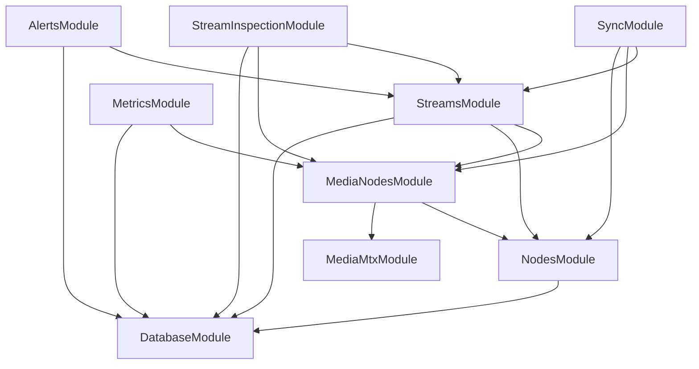

# Module map

Every Nest module in `backend/src/`, what it exports, and what it imports. Read with
[system overview](system-overview.md) for the layering and
[`backend/CONVENTIONS.md`](../../backend/CONVENTIONS.md) for the rules cited.

A module is organized around a **capability**, never around "shared" (`ARCH-06`). Its feature-root
barrel is a curated named-export surface — what the barrel exports is the feature's public
contract (`IMP-03`, `TOOL-03`, [ADR-0004](../adr/0004-curated-feature-root-barrels.md)).

## Feature modules

| Module | Source | Imports | Exports (Nest) | Controllers |
|---|---|---|---|---|
| `NodesModule` | [`src/nodes/`](../../backend/src/nodes/) | `DatabaseModule`, `ConfigModule` | `NodeLifecycleService`, `NodeQueryService` | `NodesController` |
| `MediaNodesModule` | [`src/media-nodes/`](../../backend/src/media-nodes/) | `ConfigModule`, `NodesModule`, `MediaMtxModule` | `NodeResolver`, `MediaMtxStreamListingService`, `MediaMtxStreamStatsService`, `MediaMtxPipelineService`, `MediaMtxMetricsService` | — |
| `StreamsModule` | [`src/streams/`](../../backend/src/streams/) | `DatabaseModule`, `MediaNodesModule`, `NodesModule`, `ConfigModule` | `StreamsFacadeService`, `StreamQueryService` | `StreamsController`, `IngestController`, `IngestAuthController` |
| `SyncModule` | [`src/sync/`](../../backend/src/sync/) | `MediaNodesModule`, `StreamsModule`, `NodesModule` | — | `IngestActivationController` |
| `MetricsModule` | [`src/metrics/`](../../backend/src/metrics/) | `DatabaseModule`, `MediaNodesModule` | `MetricPersistenceService` | `MetricsController` |
| `StreamInspectionModule` | [`src/stream-inspection/`](../../backend/src/stream-inspection/) | `DatabaseModule`, `MediaNodesModule`, `StreamsModule` | `StreamInspectionQueryService` | `StreamInspectionController` |
| `AlertsModule` | [`src/alerts/`](../../backend/src/alerts/) | `DatabaseModule`, `ConfigModule`, `StreamsModule` | — | `AlertsController` |
| `GatewayModule` | [`src/gateway/`](../../backend/src/gateway/) | — | `EventsGateway` | — |

`StreamsModule` exports only two of its services. Outsiders reach the feature through
`StreamsFacadeService`, or through `StreamQueryService` when they need reads only (`SVC-04`).
The mutation, assignment, and pipeline services are internal.

## Infrastructure and cross-cutting modules

| Module | Source | Role |
|---|---|---|
| `DatabaseModule` | [`src/infrastructure/database/`](../../backend/src/infrastructure/database/) | Storage composition root: registers every schema, binds each port to its Mongo adapter, exports the port tokens (`ARCH-08`). |
| `MediaMtxModule` | [`src/infrastructure/media-mtx/`](../../backend/src/infrastructure/media-mtx/) | MediaMTX gateway: clients, caching factories, `MediaMtxClientRegistry`, boundary mappers, wire types (`ARCH-10`, `INT-01..05`). |
| `ConfigModule` | [`src/config/`](../../backend/src/config/) | The only reader of `process.env` outside bootstrap (`CFG-01`). |
| `SchedulingModule` | [`src/common/scheduling/`](../../backend/src/common/scheduling/) | Discovers `@ScheduledTask` methods, runs them on their configured interval, guards each run, prevents overlap (`JOB-01..03`). |

`src/common/` holds shared **non-provider** code only — domain types, enums, consts, pure utils.
There is no catch-all `CommonModule`; `SchedulingModule` is a purpose-named cross-cutting module
(`ARCH-06`).

## Dependency direction

The graph is acyclic and the tree uses **no** `forwardRef` (`ARCH-04`). Two facts keep it that
way, both load-bearing:

1. `MediaMtxModule` does not import `NodesModule`. The three infra services that once injected
   `NodeQueryService` were moved into the `media-nodes` feature, so the arrow inverted
   (`ARCH-09`, `ARCH-10`).
2. Feature modules take the persistence root through the `@/infrastructure/database` sub-barrel,
   not the full `@/infrastructure` barrel, so they do not drag `media-mtx` into their graph
   (`IMP-01`, `IMP-04`, [ADR-0008](../adr/0008-runtime-safe-barrel-imports.md)).

`GatewayModule` appears in no arrow: it subscribes to `EventEmitter2` and injects nothing from a
feature (`EVT-02`).

## Capability-to-module mapping

Which module owns each behavioral capability. Baseline status is tracked in
[the specification map](../specification-map.md).

| Capability | Owning module(s) |
|---|---|
| Node registry and heartbeat | `NodesModule` |
| Stream reservation | `StreamsModule` (`StreamReservationService`, `IngestPlacementService`) |
| Stream assignment | `StreamsModule` (`StreamAssignmentService`, `StreamStatusService`) |
| Stream pipeline lifecycle | `StreamsModule` (`StreamPipelineService`) + `MediaNodesModule` (`MediaMtxPipelineService`) |
| Stream synchronization and reconciliation | `SyncModule` |
| Stream inspection | `StreamInspectionModule` |
| Metrics collection | `MetricsModule` + `MediaNodesModule` (`MediaMtxMetricsService`) |
| Alert reconciliation | `AlertsModule` |
| Realtime event broadcast | `GatewayModule` |

## Not verified in this document

- Provider lists are summarized, not exhaustive. Read each `*.module.ts` for the full list.
- The tables above come from the module files themselves. This document is now the only
  structural model of the backend modules — the LikeC4 model was dropped
  ([ADR-0016](../adr/0016-drop-likec4-architecture-model.md)) and no rule enforces that this
  document stays current, so check `last_verified` above before relying on it.
