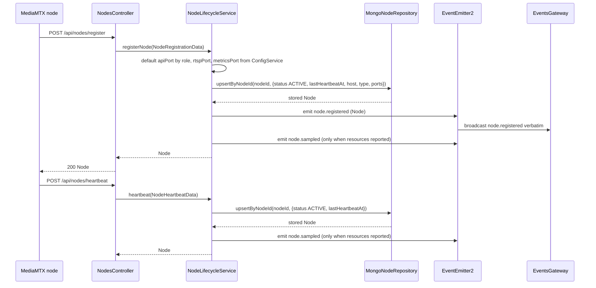
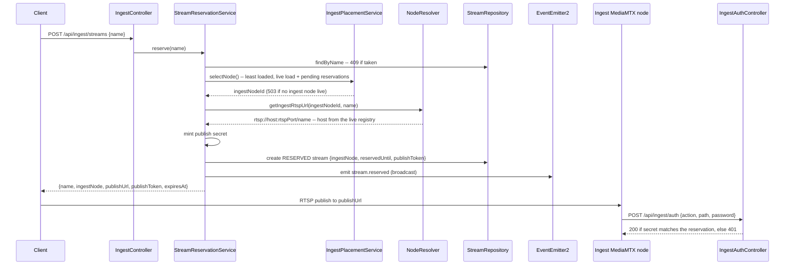
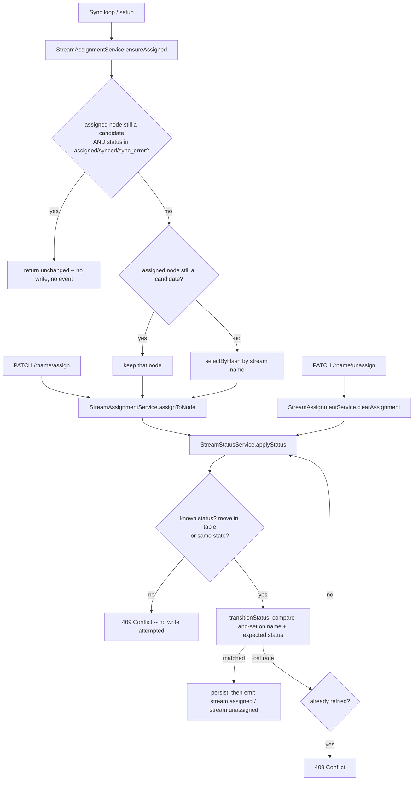

# Runtime flows

Sequences that cross module boundaries. Only flows read line-by-line against the source are
drawn; the rest are named, source-linked, and marked unverified so a reader knows the
difference.

Diagrams here are Mermaid (`DOC-02`).

## Verified: node registration and heartbeat

Read against [`nodes.controller.ts`](../../backend/src/nodes/controllers/nodes.controller.ts),
[`node-lifecycle.service.ts`](../../backend/src/nodes/services/lifecycle/node-lifecycle.service.ts),
[`mongo-node.repository.ts`](../../backend/src/infrastructure/database/mongo/node/mongo-node.repository.ts),
and [`events.gateway.ts`](../../backend/src/gateway/events.gateway.ts).
No canonical behavioral OpenSpec currently exists; see the
[node registration subsystem](../subsystems/node-registration-and-heartbeat.md).

`node.sampled` is deliberately **not** on `EventsGateway.BROADCAST_EVENTS` (`EVT-03`); it feeds
the alert pipeline as a producer ([ADR-0011](../adr/0011-node-resource-alerts-third-producer.md)).

Liveness is not a state transition. `GET /api/nodes/active` derives the live set at read time
from `status = active` **and** `lastHeartbeatAt >= now - NODE_HEALTH_TOLERANCE_SECONDS`
([`node-query.service.ts`](../../backend/src/nodes/services/query/node-query.service.ts)). No
process demotes a silent node.

## Verified: reserve, publish, authorize, expire

Read against [`ingest.controller.ts`](../../backend/src/streams/controllers/ingest.controller.ts),
[`stream-reservation.service.ts`](../../backend/src/streams/services/orchestration/stream-reservation.service.ts),
[`ingest-placement.service.ts`](../../backend/src/streams/services/assignment/ingest-placement.service.ts),
[`node-resolver.service.ts`](../../backend/src/media-nodes/services/topology/node-resolver.service.ts),
[`ingest-auth.controller.ts`](../../backend/src/streams/controllers/ingest-auth.controller.ts),
and [`publish-auth.service.ts`](../../backend/src/streams/services/query/publish-auth.service.ts).
No canonical behavioral OpenSpec currently exists; see the
[reservation subsystem](../subsystems/stream-reservation-and-publication.md).
Decision: [ADR-0013](../adr/0013-reserve-publish-ingest-cluster.md).

Two things a reader usually gets wrong here:

- **There is no confirm call.** Publishing *is* the claim. The sync loop discovers the now-live
  stream and relays it to a cluster node; see the flows below.
- **The publish secret does not outlive the reservation.** Promotion out of `reserved` clears it,
  so a publisher that drops and redials is denied. This contradicts
  `PublishAuthService`'s own docstring and is recorded as an open conflict in
  [the specification map](../specification-map.md).

An unclaimed reservation is freed by the periodic sweep below, not by any client action: the
staleness step deletes each `reserved` stream past its `reservedUntil`, under a delete filter
that re-checks both, so a reservation claimed mid-sweep survives.

## Verified: assignment and lifecycle transitions

Read against [`stream-assignment.service.ts`](../../backend/src/streams/services/assignment/stream-assignment.service.ts),
[`stream-status.service.ts`](../../backend/src/streams/services/mutation/stream-status.service.ts),
[`stream-status-transitions.const.ts`](../../backend/src/streams/domain/consts/stream-status-transitions.const.ts),
and [`mongo-stream.repository.ts`](../../backend/src/infrastructure/database/mongo/stream/mongo-stream.repository.ts).
No canonical behavioral OpenSpec currently exists; see the
[assignment subsystem](../subsystems/stream-assignment-and-pipeline-deployment.md).
Decision: [ADR-0014](../adr/0014-guard-stream-lifecycle-transitions.md).

Every persisted lifecycle write — from the API, from setup, from the sync loop — goes through one
authority. There is no second writer.

Four properties worth knowing:

- **The illegal-move check runs before any write.** A rejected transition attempts no database
  operation at all, so a 409 leaves the record untouched.
- **The retry re-validates, it does not re-write.** On losing the compare-and-set it re-reads the
  winning state and re-checks the table against it. Bounded at one retry — a second loss is a 409.
- **Convergence is sticky twice over.** A stream keeps its own node when that node is still a
  candidate, and the hash fallback is deterministic by name, so a stream does not drift between
  ticks (`INT-06`).
- **`reserved` and `stale` reach neither `assigned` nor `pending_assignment`.** Both map only to
  `discovered`, so assigning or unassigning from either state is a 409.

There is **no failover.** A stream moves off a node only when convergence runs and finds that node
absent from the candidate list. Two documents claim otherwise — see
[the specification map](../specification-map.md).

## Verified: the synchronization cycle

Read against [`sync-scheduler.service.ts`](../../backend/src/sync/services/scheduler/sync-scheduler.service.ts),
[`sync-context-builder.service.ts`](../../backend/src/sync/services/context/sync-context-builder.service.ts),
[`sync-orchestrator.service.ts`](../../backend/src/sync/services/orchestration/sync-orchestrator.service.ts),
the three workflow services in [`sync/services/workflows/`](../../backend/src/sync/services/workflows/),
and [`job-scheduler.service.ts`](../../backend/src/common/scheduling/job-scheduler.service.ts).
No canonical behavioral OpenSpec currently exists; see the
[synchronization subsystem](../subsystems/synchronization-and-reconciliation.md).
This is the shape `SVC-03` and `JOB-01..03` prescribe.

```mermaid
flowchart LR
    JS[JobScheduler -- discovers ScheduledTask at bootstrap, guards each run, skips overlapping ticks]
    S[SyncSchedulerService.periodicSync]
    B[SyncContextBuilderService.buildContext]
    O[SyncOrchestratorService.execute]
    W1[IngestStreamSynchronizerService]
    W2[StreamReconcileService]
    W3[StreamStalenessService]
    EV[emit sync.tick -- counts + failed step names]

    JS -->|every syncPollInterval| S
    S --> B
    B -->|SyncContext| O
    O --> W1 --> W2 --> W3 --> EV
```

Five properties are worth knowing before reading any of it:

- A step failure is caught per step, logged by name, and collected — one failing step aborts
  neither the others nor the `sync.tick` emit (`SVC-03`, `runStep`). There is no retry or backoff;
  the next tick simply runs again.
- When the context carries no active cluster node IDs, the two placement workflows are skipped
  with a warning and only staleness runs — retiring a departed stream needs no cluster node.
- `sync.tick` is a diagnostics event and stays off the broadcast whitelist (`EVT-03`). Its
  `ingest` and `cluster` counts are the **observation** sizes, not work performed.
- **A failed scrape is not an absent stream.** The context records both which ingest nodes were
  live and which actually answered, and `canConfirmAbsent` retires a stream only when its own node
  answered, or has left the live set entirely. Without that split, one unreachable node would
  retire every stream on it.
- `JobScheduler` owns the cross-cutting parts: one interval resolved at bootstrap, a per-job
  overlap guard so a slow cycle never races its next tick, and a `try/catch` so a throw never
  kills the timer (`JOB-01..03`).

The three registered jobs and their cadences (`JOB-03`, all resolved from `ConfigService` at
bootstrap): `sync.periodic` (`SYNC_POLL_INTERVAL`, 10s), `metrics.collect`
(`METRICS_POLL_INTERVAL`, 10s), and stream inspection (`INSPECTION_INTERVAL`, 30s).

### Targeted activation — the low-latency path

An ingest node's `runOnReady` hook calls `POST /api/nodes/:nodeId/stream-ready` the instant a path
starts publishing, so that one stream is relayed without waiting for the next tick. It reuses the
same record and assign leaf steps the cycle uses — not the orchestrator, and no node scan
(`SVC-10`, `SVC-11`). The call is awaited and answers 202; a relay failure surfaces to the node.

Recording a stream live on ingest is also what **promotes** a claimed reservation: it moves a
`reserved` stream to `discovered` and clears its reservation deadline **and its publish secret**.
Clearing the secret is what makes a publisher unable to redial — see
[the specification map](../specification-map.md).

## Named, not verified here

Each of these was located but **not** read line-by-line for this document. Do not treat the
one-line summaries as contracts — read the source, and prefer a canonical specification once one
exists ([specification map](../specification-map.md)).

| Flow | Entry point | Status |
|---|---|---|
| Cluster pipeline build/deploy/teardown | [`stream-pipeline.service.ts`](../../backend/src/streams/services/orchestration/stream-pipeline.service.ts) | Not verified. Rule: `INT-06` |
| Metrics collection and persistence | [`metric-collection.service.ts`](../../backend/src/metrics/services/collection/metric-collection.service.ts) | Not verified |
| Stream inspection | [`stream-inspection-collection.service.ts`](../../backend/src/stream-inspection/services/collection/stream-inspection-collection.service.ts) | Not verified |
| Alert produce → evaluate → reconcile | [`alerts/services/`](../../backend/src/alerts/services/) | Not verified. Decisions: [ADR-0010](../adr/0010-event-driven-alert-pipeline.md), [ADR-0011](../adr/0011-node-resource-alerts-third-producer.md) |

`backend/SYSTEM_DOCUMENTATION.md` describes several of these flows in prose. It is a reference
document, not a verified authority — check it against the source before relying on it.

## Event reference

Names live in
[`system-event-names.const.ts`](../../backend/src/common/domain/consts/system-event-names.const.ts);
payload shapes in `backend/src/common/domain/types/event-payloads.types.ts` (`EVT-05`). The
broadcast whitelist is `EventsGateway.BROADCAST_EVENTS` and is asserted exactly in
[`events.gateway.test.ts`](../../backend/test/gateway/events.gateway.test.ts).

**Broadcast to WebSocket clients:** `stream.synced`, `stream.removed`, `stream.reserved`,
`stream.assigned`, `stream.unassigned`, `stream.inspected`, `alert.created`, `alert.updated`,
`alert.resolved`, `node.registered`.

**Internal only:** `metrics.collected`, `node.sampled`, `sync.tick`.
