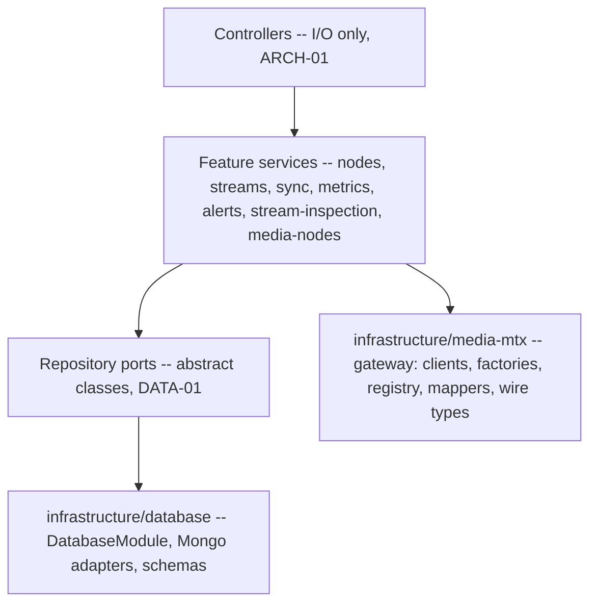

# System overview

What the system is, what runs, and where each boundary sits. Structure only — behavior lives in
[the specifications](../../openspec/specs/) and the rules live in
[`backend/CONVENTIONS.md`](../../backend/CONVENTIONS.md).

## Containers

| Container | Source | What it is |
|---|---|---|
| Sync service | [`backend/`](../../backend/) | NestJS app. REST under `/api`, Swagger UI at `/api/docs`, Socket.IO realtime. The control plane. |
| Dashboard | [`frontend/`](../../frontend/) | Vite + React. Consumes the backend contract as-is; proxies `/api` and `/socket.io`. |
| MongoDB | — | Stores streams, nodes, alerts, node metrics, path metrics, stream inspections. |
| MediaMTX ingest nodes | [`backend/deploy/`](../../backend/deploy/) | A cluster of MediaMTX instances that accept published media. Addressed per node, by host **+** self-reported port ([ADR-0013](../adr/0013-reserve-publish-ingest-cluster.md)). |
| MediaMTX cluster nodes | [`backend/deploy/`](../../backend/deploy/) | StatefulSet of MediaMTX instances that relay assigned streams ([ADR-0012](../adr/0012-cluster-nodes-as-statefulset.md)). |

The sync service never sits in the media path. It is a control plane: it decides placement,
creates and tears down MediaMTX paths over the v3 HTTP API, and scrapes Prometheus metrics.
Media flows publisher → ingest node → cluster node without passing through the backend.

## Layering

Dependency arrows run one way: feature → infrastructure, never back (`ARCH-09`, `PHIL-04`).

Three seams carry most of the weight:

- **Persistence is composed in exactly one place.** `DatabaseModule` registers every schema and
  binds each port to its Mongo adapter; feature modules import it and depend only on the port
  token (`ARCH-08`, `ARCH-02`, [ADR-0002](../adr/0002-abstract-repositories-with-mongo-implementations.md)).
- **The MediaMTX gateway is transport only.** Raw v3 and Prometheus shapes never leave
  `infrastructure/media-mtx`; clients map to domain shapes at the boundary (`INT-01`, `INT-04`,
  [ADR-0001](../adr/0001-mediamtx-v3-api-behind-infrastructure-layer.md)). The application logic
  that *operates* the gateway lives in the `media-nodes` feature (`ARCH-10`).
- **The transport adapter is addressless.** It turns a caller-supplied host into a client and
  holds no node addresses. Runtime topology has one source of truth: the node registry, fed by
  heartbeats (`ARCH-11`, [ADR-0009](../adr/0009-pod-derived-cluster-topology.md)). That registry's
  behavior is specified in
  [the `node-registry` baseline](../../openspec/changes/baseline-node-registry-specification/specs/node-registry/spec.md).

See [module map](module-map.md) for the module-by-module breakdown and
[runtime flows](runtime-flows.md) for the sequences.

## Cross-cutting mechanisms

| Mechanism | Where | Rules |
|---|---|---|
| Scheduled jobs | `@ScheduledTask` + `JobScheduler` in `backend/src/common/scheduling/` | `JOB-01..03` |
| Events | `EventEmitter2`, names in `backend/src/common/domain/consts/system-event-names.const.ts` | `EVT-01`, `EVT-05` |
| WebSocket broadcast | `EventsGateway.BROADCAST_EVENTS` — the only place Socket.IO is touched | `EVT-02`, `EVT-03` |
| Validation | Global `ValidationPipe` in `backend/src/main.ts`, DTOs per feature | `DTO-01..03` |
| Configuration | `ConfigService` getters only; no `process.env` outside `config/` | `CFG-01..03` |
| Alert pipeline | produce → evaluate → reconcile | `SVC-06`, [ADR-0010](../adr/0010-event-driven-alert-pipeline.md), [ADR-0011](../adr/0011-node-resource-alerts-third-producer.md) |

## Diagram sources

Mermaid in repository Markdown is the sole diagram source (`DOC-02`). The LikeC4 model that
previously lived here was dropped when its trial ended
([ADR-0016](../adr/0016-drop-likec4-architecture-model.md), superseding the trial decision in
[ADR-0006](../adr/0006-documentation-tooling-choices.md)); `DOC-04`, the rule that required
maintaining it, is retired. No rule now forces these documents to be updated when a module
changes — the `last_verified` frontmatter is the only drift signal, so check it before relying
on a diagram.

## Not verified in this document

- Deployment topology (replica counts, probes, service wiring) is described in
  `backend/deploy/` and `backend/SYSTEM_DOCUMENTATION.md` and was **not** re-verified here.
- Frontend internals were not inspected. Only its stated relationship to the backend contract
  is recorded, from [`README.md`](../../README.md).
