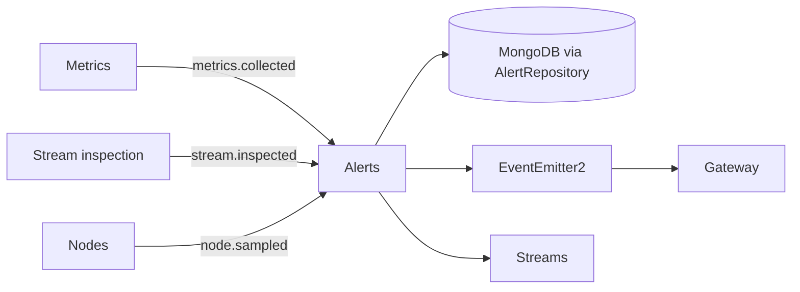

# Alerts

## Responsibility

The Alerts feature translates metric, inspection, and node-resource observations into a
persisted desired set of open alerts. It owns rule evaluation, per-source/subject reconciliation,
alert lifecycle events, REST listing, and manual resolution.

## Boundaries

### Owns

- Metric, track, and node-resource alert rules and their evaluation.
- Reconciliation of desired alert identities with unresolved persisted alerts.
- Alert records, the unresolved-alert uniqueness rule, and lifecycle events.
- Query and manual-resolution REST operations.

### Does not own

- Producing metrics, stream inspections, or node samples.
- Stream, node, or MediaMTX state changes in response to an alert.
- WebSocket delivery; [Gateway](gateway.md) broadcasts selected lifecycle events.

## Public surface

| Export or endpoint | Responsibility | Consumers |
|---|---|---|
| `AlertsModule` | Wires rulers, reconciliation, event listeners, repository, and controller; exports no providers | `AppModule` |
| `GET /api/alerts` | Lists alerts through access-service filters | REST clients |
| `PATCH /api/alerts/:id/resolve` | Manually resolves one alert | REST clients |
| `AlertRepository` and alert domain types | Persistence port and compile-time contracts | Database infrastructure and alert services |

No alert provider is a supported injectable cross-feature API.

## Entry points

- [`AlertsController`](../../backend/src/alerts/controllers/alerts.controller.ts) provides REST
  access and manual resolution.
- Metric, track, and node-resource rulers handle `metrics.collected`, `stream.inspected`, and
  `node.sampled` events respectively.
- The feature has no scheduled job.

## Internal concerns

| Concern | Path | Responsibility |
|---|---|---|
| Rulers | [`services/rulers/`](../../backend/src/alerts/services/rulers/) | Convert observation payloads into desired alert definitions |
| Evaluation | [`services/evaluation/`](../../backend/src/alerts/services/evaluation/) | Apply declarative rule predicates |
| Reconciliation | [`services/reconciliation/`](../../backend/src/alerts/services/reconciliation/) | Create/update desired alerts and resolve obsolete ones |
| Access | [`services/access/`](../../backend/src/alerts/services/access/) | REST-facing query and manual resolution |
| Persistence port | [`repositories/`](../../backend/src/alerts/repositories/) | Alert storage operations |

## Owned data

| Entity or state | Contract | Persistence adapter | Ownership |
|---|---|---|---|
| Alert lifecycle record | [`Alert`](../../backend/src/alerts/domain/types/alert/alert.types.ts), [`AlertRepository`](../../backend/src/alerts/repositories/alert.repository.ts) | [`MongoAlertRepository`](../../backend/src/infrastructure/database/mongo/alert/mongo-alert.repository.ts), [`AlertSchema`](../../backend/src/infrastructure/database/mongo/alert/alert.schema.ts) | Alerts owns identity, desired state, and resolution semantics; Database owns Mongo mapping |

## Events

### Produces

| Event | Trigger | Payload type | Owner |
|---|---|---|---|
| `alert.created` | A previously absent unresolved identity is created | `Alert` (no shared event payload declaration) | `AlertReconcileService` |
| `alert.updated` | An existing unresolved identity is refreshed | `Alert` (no shared event payload declaration) | `AlertReconcileService` |
| `alert.resolved` | Reconciliation or manual action resolves an alert | `Alert` (no shared event payload declaration) | Reconciler/access service |

### Consumes

| Event | Trigger | Payload type | Owner |
|---|---|---|---|
| `metrics.collected` | Metric snapshot persisted | `MetricsCollectedPayload` | `MetricAlertRulerService` |
| `stream.inspected` | Inspection record persisted | `StreamInspectedPayload` | `TrackAlertRulerService` |
| `node.sampled` | Node request includes resources | `NodeSampledPayload` | `NodeResourceRulerService` |

The consumed observation events use shared payload declarations under
[`common/domain`](../../backend/src/common/domain/); the produced alert lifecycle events do not.

## Dependencies

## Primary flows

- [Alert evaluation and reconciliation](../subsystems/alert-evaluation-and-reconciliation.md)
- [Metrics collection](../subsystems/metrics-collection.md)
- [Stream inspection](../subsystems/stream-inspection.md)
- [Node registration and heartbeat](../subsystems/node-registration-and-heartbeat.md)
- [Realtime event broadcast](../subsystems/realtime-event-broadcast.md)

## Behavioral specifications

No canonical OpenSpec specification currently exists for this capability. See the
[specification map](../specification-map.md).

## Architecture decisions

- [ADR-0003: Data-driven track parsing](../adr/0003-data-driven-track-parsing.md) — Accepted.
- [ADR-0010: Event-driven alert pipeline](../adr/0010-event-driven-alert-pipeline.md) — Accepted.
- [ADR-0011: Node resource alerts as a third producer](../adr/0011-node-resource-alerts-third-producer.md) — Accepted.

## Governing conventions

See the [conventions registry](../../backend/CONVENTIONS.md).

| Rule | Relevance |
|---|---|
| `PHIL-01`, `ARCH-04` | Feature ownership and event-driven reaction boundary |
| `DATA-01`, `DATA-05` | Repository ownership and database-enforced stable alert identity |
| `EVT-01`–`EVT-05` | Mutation-owned lifecycle events and typed observation contracts |
| `TEST-01`, `TEST-05` | Mirrored and cross-service behavior coverage |
| `DOC-06` | Feature/subsystem documentation maintenance |

## Validation

- `cd backend && npm test -- --runInBand test/alerts`
- `cd backend && npm run verify`
- `openspec validate --all`

## Known limitations

- A failed/unknown-stream inspection is ignored rather than reconciled, so it cannot itself
  resolve a previously open track alert.
- If a node stops sending samples, no absence event resolves its existing resource alert.
- Alert lifecycle events lack shared payload declarations, contrary to `EVT-05`.
- Lifecycle emission follows persistence but is not transactionally coupled to external event
  consumers; the in-process bus is best effort.

## Evidence

| Claim | Implementation evidence | Test evidence |
|---|---|---|
| One unresolved alert is enforced per source/subject/type | [`alert.schema.ts`](../../backend/src/infrastructure/database/mongo/alert/alert.schema.ts), [`mongo-alert.repository.ts`](../../backend/src/infrastructure/database/mongo/alert/mongo-alert.repository.ts) | [`alert-reconcile.service.test.ts`](../../backend/test/alerts/services/reconciliation/alert-reconcile.service.test.ts) |
| Reconciliation creates, refreshes, and resolves the desired set | [`alert-reconcile.service.ts`](../../backend/src/alerts/services/reconciliation/alert-reconcile.service.ts) | [`alert-reconcile.service.test.ts`](../../backend/test/alerts/services/reconciliation/alert-reconcile.service.test.ts) |
| Three observation families drive distinct rulers | [`services/rulers/`](../../backend/src/alerts/services/rulers/) | [`services/rulers/`](../../backend/test/alerts/services/rulers/) |
| REST access delegates to the access service | [`alerts.controller.ts`](../../backend/src/alerts/controllers/alerts.controller.ts) | [`alerts.controller.test.ts`](../../backend/test/alerts/controllers/alerts.controller.test.ts) |
