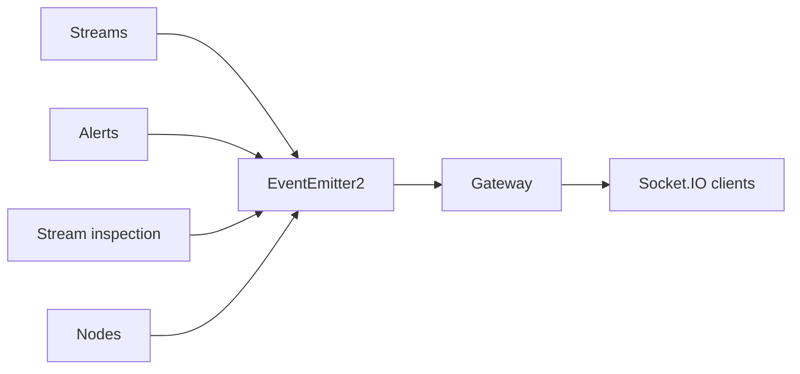

# Gateway

## Responsibility

Gateway is the Socket.IO delivery adapter for selected in-process system events. It registers an
explicit whitelist of listeners after the WebSocket server exists and broadcasts each selected
event name with its payload unchanged.

## Boundaries

### Owns

- Socket.IO server integration and listener registration.
- The whitelist of events exposed to realtime clients.
- Verbatim broadcast of selected payloads.

### Does not own

- Producing, persisting, validating, transforming, replaying, or acknowledging domain events.
- Client authentication/authorization policy beyond configured transport behavior.
- An inbound WebSocket command API; no message handlers exist.

## Public surface

| Export or endpoint | Responsibility | Consumers |
|---|---|---|
| `GatewayModule` | Registers the gateway | `AppModule` |
| `EventsGateway` | Socket.IO adapter and event whitelist | Nest runtime |

The feature exposes no REST endpoint or cross-feature application service.

## Entry points

- [`EventsGateway`](../../backend/src/gateway/events.gateway.ts) receives selected EventEmitter2
  events and emits Socket.IO events.
- There are no controllers, scheduled jobs, or inbound message handlers.

## Internal concerns

| Concern | Path | Responsibility |
|---|---|---|
| Realtime transport | [`events.gateway.ts`](../../backend/src/gateway/events.gateway.ts) | Listener registration, whitelist, and Socket.IO broadcast |

## Owned data

Gateway owns no persisted data or domain state. Its only runtime state is the Socket.IO server
reference and registered in-process listeners.

## Events

### Produces

Gateway produces no in-process system event. It transports consumed events externally.

### Consumes

| Event | Trigger | Payload type | Owner |
|---|---|---|---|
| `stream.synced`, `stream.removed`, `stream.reserved`, `stream.assigned`, `stream.unassigned` | Streams emits a lifecycle fact | Mixed direct values/objects; several lack shared declarations | Streams |
| `alert.created`, `alert.updated`, `alert.resolved` | Alerts emits a lifecycle fact | `Alert`; no shared event payload declaration | Alerts |
| `stream.inspected` | Inspection record persisted | `StreamInspectedPayload` | Stream Inspection |
| `node.registered` | Registration persisted | `Node`; no shared event payload declaration | Nodes |

`metrics.collected`, `node.sampled`, and `sync.tick` remain internal and are not broadcast.

## Dependencies

## Primary flows

- [Realtime event broadcast](../subsystems/realtime-event-broadcast.md)

## Behavioral specifications

No canonical OpenSpec specification currently exists. See the
[specification map](../specification-map.md).

## Architecture decisions

- [ADR-0010: Event-driven alert pipeline](../adr/0010-event-driven-alert-pipeline.md) — Accepted.
- [ADR-0004: Curated feature-root barrels](../adr/0004-curated-feature-root-barrels.md) — Accepted.

## Governing conventions

See the [conventions registry](../../backend/CONVENTIONS.md).

| Rule | Relevance |
|---|---|
| `PHIL-01`, `PHIL-05` | Feature ownership and curated public surface |
| `EVT-01`–`EVT-05` | Event ownership, internal/broadcast separation, and payload contracts |
| `TEST-01` | Mirrored gateway test coverage |
| `DOC-06` | Feature/subsystem documentation maintenance |

## Validation

- `cd backend && npm test -- --runInBand test/gateway`
- `cd backend && npm run verify`
- `openspec validate --all`

## Known limitations

- Delivery is in-process and best effort: there is no durable queue, replay, retry, client ack,
  or ordering guarantee beyond the current emitter/Socket.IO calls.
- Payloads are sent verbatim; several whitelisted stream/node events do not have shared payload
  declarations under `common/events`.
- Events emitted before listener/server initialization or while no client is connected are not
  recoverable.

## Evidence

| Claim | Implementation evidence | Test evidence |
|---|---|---|
| Only the explicit ten-event whitelist is registered | [`events.gateway.ts`](../../backend/src/gateway/events.gateway.ts) | [`events.gateway.test.ts`](../../backend/test/gateway/events.gateway.test.ts) |
| Event names and payloads are broadcast unchanged | [`events.gateway.ts`](../../backend/src/gateway/events.gateway.ts) | [`events.gateway.test.ts`](../../backend/test/gateway/events.gateway.test.ts) |
| The root barrel exposes only the module and gateway | [`index.ts`](../../backend/src/gateway/index.ts) | [`events.gateway.test.ts`](../../backend/test/gateway/events.gateway.test.ts) |
