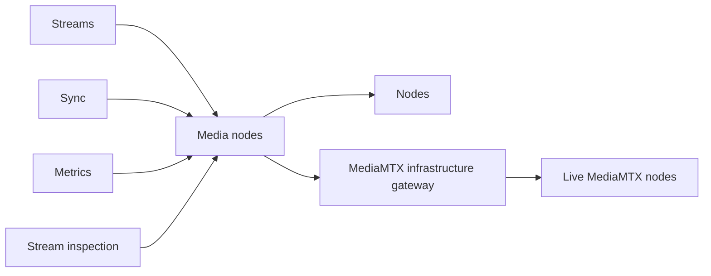

# Media nodes

## Responsibility

Media Nodes is the application-facing boundary over the MediaMTX infrastructure gateway. It
resolves registered node coordinates and provides contextual stream listing, stream statistics,
pipeline create/delete, metric scraping, and derived node loads.

## Boundaries

### Owns

- Mapping live registry records to role-specific MediaMTX targets.
- Per-node fan-out, result aggregation, and operation-specific failure isolation.
- Application semantics for pipeline idempotency and contextual stream observations.

### Does not own

- Node registry persistence, stream lifecycle state, metric/inspection persistence, or schedules.
- HTTP client/protocol details; infrastructure owns MediaMTX transport and response parsing.
- Selection of a stream's assigned node; Streams supplies the assignment.

## Public surface

| Export or endpoint | Responsibility | Consumers |
|---|---|---|
| `MediaNodesModule` | Wires infrastructure and Nodes; Nest-exports all application operations | Streams, Metrics, Stream Inspection, Sync |
| `NodeResolverService` | Resolve live node coordinates by role/id | Other Media Nodes services, Streams |
| `MediaMtxStreamListingService` | List contextual streams and observed-node coverage | Sync, Stream Inspection |
| `MediaMtxStreamStatsService` | Fetch path/track detail from a chosen node | Stream Inspection |
| `MediaMtxPipelineService` | Create on assigned node and delete across live cluster nodes | Streams |
| `MediaMtxMetricsService` | Scrape active nodes and derive cluster loads | Metrics, Streams |

All listed services are in the curated root barrel. `StreamCollectionService` is internal and is
not Nest-exported or root-exported.

## Entry points

The feature has no controller, event handler, or schedule. Its exported services are called by
Streams, Sync, Metrics, and Stream Inspection.

## Internal concerns

| Concern | Path | Responsibility |
|---|---|---|
| Topology | [`services/topology/`](../../backend/src/media-nodes/services/topology/) | Registry-to-MediaMTX target resolution |
| Listing | [`services/listing/`](../../backend/src/media-nodes/services/listing/) | Per-node path listing and contextual aggregation |
| Stats | [`services/stats/`](../../backend/src/media-nodes/services/stats/) | Targeted stream detail lookup |
| Pipeline | [`services/pipeline/`](../../backend/src/media-nodes/services/pipeline/) | Assigned-node create and cluster-wide teardown |
| Metrics | [`services/metrics/`](../../backend/src/media-nodes/services/metrics/) | Per-node scrape and load derivation |

## Owned data

Media Nodes owns no persisted data. It returns transient targets, contextual observations,
metrics, and operation results derived from Nodes and MediaMTX.

## Events

### Produces

The feature emits no system events. Callers own lifecycle/observation events after its operations.

### Consumes

The feature has no `@OnEvent` handlers.

## Dependencies

## Primary flows

- [Metrics collection](../subsystems/metrics-collection.md)
- [Stream inspection](../subsystems/stream-inspection.md)
- [Stream assignment and pipeline deployment](../subsystems/stream-assignment-and-pipeline-deployment.md)
- [Synchronization and reconciliation](../subsystems/synchronization-and-reconciliation.md)

## Behavioral specifications

No canonical OpenSpec specification currently exists. See the
[specification map](../specification-map.md).

## Architecture decisions

- [ADR-0001: MediaMTX v3 API behind the infrastructure layer](../adr/0001-mediamtx-v3-api-behind-infrastructure-layer.md) — Accepted; its registry ownership detail is historical.
- [ADR-0009: Pod-derived cluster topology](../adr/0009-pod-derived-cluster-topology.md) — Accepted; later node-registry decisions changed parts of the topology model.
- [ADR-0012: Cluster nodes as a StatefulSet](../adr/0012-cluster-nodes-as-statefulset.md) — Accepted.
- [ADR-0013: Reserve→publish ingestion](../adr/0013-reserve-publish-ingest-cluster.md) — Accepted.

## Governing conventions

See the [conventions registry](../../backend/CONVENTIONS.md).

| Rule | Relevance |
|---|---|
| `PHIL-01`, `PHIL-05`, `SVC-04` | Feature ownership, curated exports, and application boundary |
| `ARCH-09`–`ARCH-11` | Addressless gateway and registry-owned topology |
| `INT-01`–`INT-06` | External mapping, failure isolation, and per-node targeting |
| `TEST-01`, `TEST-05` | Mirrored tests and integration-edge behavior coverage |
| `DOC-06` | Feature/subsystem documentation maintenance |

## Validation

- `cd backend && npm test -- --runInBand test/media-nodes test/infrastructure/media-mtx`
- `cd backend && npm run verify`
- `openspec validate --all`

## Known limitations

- Stream listing and stream stats application services have no direct unit tests; collection,
  callers, and the infrastructure gateway provide indirect coverage.
- Metrics collection's per-node scrape failure isolation has no direct test; the metrics-service
  test covers role filtering and zero-filled load projection.
- Node resolution uses registered/self-reported coordinates only; there is no static fallback.
- Pipeline create treats MediaMTX HTTP 409 as already-present success. Teardown treats 404 as
  success, fans out to every live cluster node, and reports other failures only after fan-out.

## Evidence

| Claim | Implementation evidence | Test evidence |
|---|---|---|
| Resolution uses the live node registry and role-specific ports | [`node-resolver.service.ts`](../../backend/src/media-nodes/services/topology/node-resolver.service.ts) | [`node-resolver.service.test.ts`](../../backend/test/media-nodes/services/topology/node-resolver.service.test.ts) |
| Listing isolates node failures and records observed-node coverage | [`media-mtx-stream-listing.service.ts`](../../backend/src/media-nodes/services/listing/media-mtx-stream-listing.service.ts), [`stream-collection.service.ts`](../../backend/src/media-nodes/services/listing/stream-collection.service.ts) | [`stream-collection.service.test.ts`](../../backend/test/media-nodes/services/listing/stream-collection.service.test.ts) |
| Pipeline operations implement create/delete idempotency semantics | [`media-mtx-pipeline.service.ts`](../../backend/src/media-nodes/services/pipeline/media-mtx-pipeline.service.ts) | [`media-mtx-pipeline.service.test.ts`](../../backend/test/media-nodes/services/pipeline/media-mtx-pipeline.service.test.ts) |
| Missing metrics snapshots are zero-filled for active-node load projection | [`media-mtx-metrics.service.ts`](../../backend/src/media-nodes/services/metrics/media-mtx-metrics.service.ts) | [`media-mtx-metrics.service.test.ts`](../../backend/test/media-nodes/services/metrics/media-mtx-metrics.service.test.ts) |
