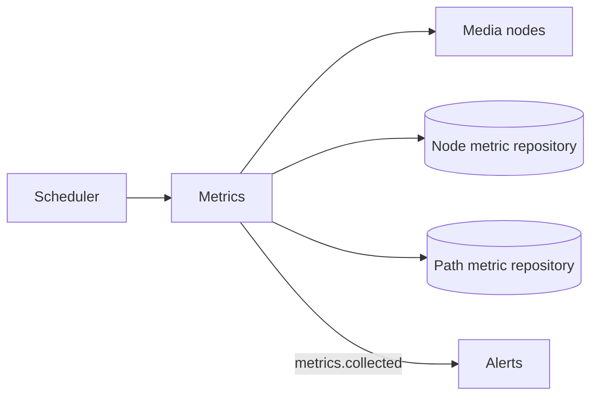

# Metrics

## Responsibility

The Metrics feature periodically collects operational samples from live MediaMTX nodes, persists
node and path observations, emits one collection snapshot, and exposes stored metrics over REST.

## Boundaries

### Owns

- The configured `metrics.collect` scheduled job and collection orchestration.
- Node-metric and path-metric records and repository contracts.
- Persistence of each snapshot and emission of `metrics.collected` after persistence succeeds.
- REST queries for stored metric history.

### Does not own

- Live-node discovery or MediaMTX scraping; [Media nodes](media-nodes.md) provides those operations.
- Threshold evaluation and alert lifecycle; [Alerts](alerts.md) consumes the snapshot.
- Node heartbeat resource samples, which follow a separate Nodes-to-Alerts path.

## Public surface

| Export or endpoint | Responsibility | Consumers |
|---|---|---|
| `MetricsModule` | Registers scheduler, controller, repositories, and services; Nest-exports `MetricPersistenceService` | `AppModule` |
| `GET /api/metrics/nodes` | Recent stored node metrics, limited by query parameter | REST clients |
| `GET /api/metrics/stream/:name` | Recent stored path metrics for one stream | REST clients |
| Metric repository ports and domain types | Storage contracts | Database infrastructure and metric services |

`MetricPersistenceService` is not exported by the feature-root barrel, and no current feature
injects it directly.

## Entry points

- [`MetricCollectionService`](../../backend/src/metrics/services/collection/metric-collection.service.ts)
  handles the `metrics.collect` interval.
- [`MetricsController`](../../backend/src/metrics/controllers/metrics.controller.ts) exposes
  persisted history.
- The feature has no event handlers.

## Internal concerns

| Concern | Path | Responsibility |
|---|---|---|
| Collection | [`services/collection/`](../../backend/src/metrics/services/collection/) | Scheduled scrape, persistence, and event emission |
| Persistence | [`services/persistence/`](../../backend/src/metrics/services/persistence/) | Batch save and read orchestration over two repositories |
| Domain | [`domain/`](../../backend/src/metrics/domain/) | Node/path metric shapes |
| Persistence ports | [`repositories/`](../../backend/src/metrics/repositories/) | Node/path history contracts |

## Owned data

| Entity or state | Contract | Persistence adapter | Ownership |
|---|---|---|---|
| Node metric samples | [`NodeMetricRepository`](../../backend/src/metrics/repositories/node-metric.repository.ts) | [`mongo-node-metric.repository.ts`](../../backend/src/infrastructure/database/mongo/node-metric/mongo-node-metric.repository.ts) | Metrics owns append/query semantics; Database owns Mongo mapping |
| Path metric samples | [`PathMetricRepository`](../../backend/src/metrics/repositories/path-metric.repository.ts) | [`mongo-path-metric.repository.ts`](../../backend/src/infrastructure/database/mongo/path-metric/mongo-path-metric.repository.ts) | Metrics owns append/query semantics; Database owns Mongo mapping |

## Events

### Produces

| Event | Trigger | Payload type | Owner |
|---|---|---|---|
| `metrics.collected` | Node and path samples have been persisted | `MetricsCollectedPayload` | `MetricCollectionService` |

### Consumes

The feature has no event handlers.

## Dependencies

## Primary flows

- [Metrics collection](../subsystems/metrics-collection.md)
- [Alert evaluation and reconciliation](../subsystems/alert-evaluation-and-reconciliation.md)

## Behavioral specifications

No canonical OpenSpec specification currently exists for this capability. See the
[specification map](../specification-map.md).

## Architecture decisions

- [ADR-0001: MediaMTX v3 API behind the infrastructure layer](../adr/0001-mediamtx-v3-api-behind-infrastructure-layer.md) — Accepted; some registry detail is historical.
- [ADR-0010: Event-driven alert pipeline](../adr/0010-event-driven-alert-pipeline.md) — Accepted; Metrics produces one of its inputs.

## Governing conventions

See the [conventions registry](../../backend/CONVENTIONS.md).

| Rule | Relevance |
|---|---|
| `PHIL-01`, `ARCH-02`, `ARCH-04` | Feature ownership, scheduler, and event boundary |
| `DATA-01`, `DATA-05` | Repository ownership and database constraints |
| `EVT-01`–`EVT-05` | Persist-then-emit typed collection event |
| `JOB-01`–`JOB-03` | Registered cadence and overlap/failure guard |
| `TEST-01`, `TEST-05`, `DOC-06` | Mirrored tests and documentation maintenance |

## Validation

- `cd backend && npm test -- --runInBand test/metrics`
- `cd backend && npm run verify`
- `openspec validate --all`

## Known limitations

- The persistence service has no direct unit or repository integration test; collection and REST
  behavior are covered with mocked dependencies.
- Per-node scrape failure isolation is implemented but has no direct unit test; the current Media
  Nodes metrics test covers role filtering and zero-filled load projection.
- Node and path batches are separate writes, so a failure can leave a partial snapshot and suppress
  the collection event.
- Samples are append-only at collection cadence; the documented code has no retention policy.

## Evidence

| Claim | Implementation evidence | Test evidence |
|---|---|---|
| Collection is scheduled and re-entry guarded | [`metric-collection.service.ts`](../../backend/src/metrics/services/collection/metric-collection.service.ts) | [`metric-collection.service.test.ts`](../../backend/test/metrics/services/collection/metric-collection.service.test.ts) |
| Live-node scrape failures are isolated per node | [`media-mtx-metrics.service.ts`](../../backend/src/media-nodes/services/metrics/media-mtx-metrics.service.ts) | No direct failure-path test; [`media-mtx-metrics.service.test.ts`](../../backend/test/media-nodes/services/metrics/media-mtx-metrics.service.test.ts) covers load projection only |
| Persistence precedes event emission | [`metric-collection.service.ts`](../../backend/src/metrics/services/collection/metric-collection.service.ts), [`metric-persistence.service.ts`](../../backend/src/metrics/services/persistence/metric-persistence.service.ts) | [`metric-collection.service.test.ts`](../../backend/test/metrics/services/collection/metric-collection.service.test.ts) |
| Controller queries node/path history | [`metrics.controller.ts`](../../backend/src/metrics/controllers/metrics.controller.ts) | [`metrics.controller.test.ts`](../../backend/test/metrics/controllers/metrics.controller.test.ts) |
