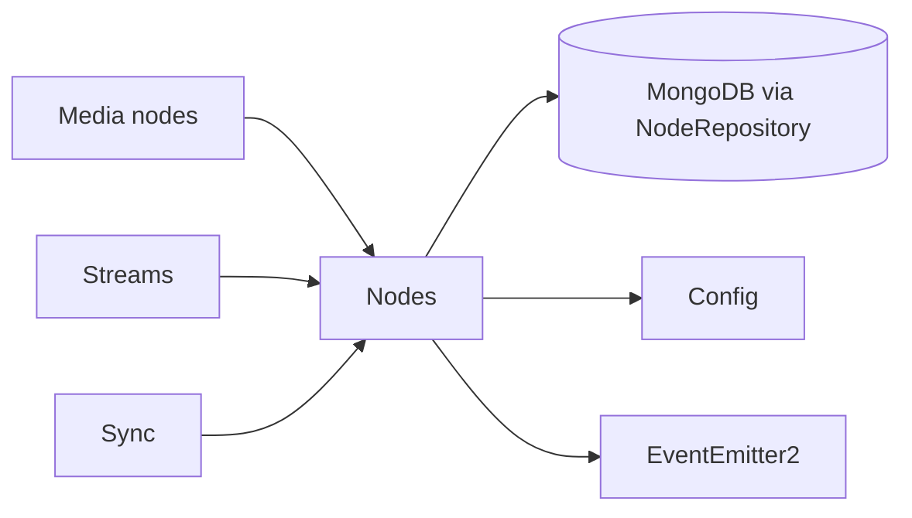

# Nodes

## Responsibility

The Nodes feature owns the runtime node registry: registration/heartbeat writes, self-reported
host and MediaMTX ports, node role/status, and queries that derive the currently live node set
from stored heartbeat time and configured tolerance.

## Boundaries

### Owns

- Persisting registration and heartbeat observations keyed by `nodeId`.
- Registration-time defaults for omitted API, RTSP, and metrics ports.
- Read-time liveness filtering by status, role, and last heartbeat timestamp.
- Publishing node registration and optional resource-sample facts.

### Does not own

- MediaMTX client construction or external calls; [Media nodes](media-nodes.md) bridges the
  registry to the infrastructure gateway.
- Stream placement, assignment, or synchronization decisions.
- Resource alert thresholds or alert lifecycle; [Alerts](alerts.md) consumes `node.sampled`.
- A background demotion/deregistration process; liveness is derived during queries.

## Public surface

| Export or endpoint | Responsibility | Consumers |
|---|---|---|
| `NodesModule` | Wires the registry and Nest-exports lifecycle/query services | `AppModule`, Streams, Sync, Media Nodes |
| `NodeQueryService` | Supported cross-feature live-node/read surface and root-barrel export | Streams, Sync, Media Nodes |
| `NodeRepository` and `Node`/`ActiveNodeRef` | Persistence port and domain contracts | `DatabaseModule`, Mongo adapter, Media Nodes |
| `GET /api/nodes`, `GET /api/nodes/active` | All-node and derived live-node REST queries | REST clients |
| `POST /api/nodes/register`, `POST /api/nodes/heartbeat` | Node-owned registration/heartbeat ingress | MediaMTX node processes |

`NodeLifecycleService` is Nest-exported but not exported from the curated feature-root barrel;
no other feature imports it directly.

## Entry points

- [`NodesController`](../../backend/src/nodes/controllers/nodes.controller.ts) exposes all four
  REST operations.
- `NodeQueryService` is called directly by Streams, Sync, and Media Nodes.
- The feature has no event handlers or scheduled jobs.

## Internal concerns

| Concern | Path | Responsibility |
|---|---|---|
| Lifecycle | [`services/lifecycle/`](../../backend/src/nodes/services/lifecycle/) | Registration/heartbeat upsert and event production |
| Query | [`services/query/`](../../backend/src/nodes/services/query/) | All-node and live-node projections |
| Domain | [`domain/`](../../backend/src/nodes/domain/) | Node, active-ref, registration, heartbeat, and resource shapes |
| Transport | [`dto/`](../../backend/src/nodes/dto/) | Validated registration/heartbeat DTOs |
| Persistence port | [`repositories/`](../../backend/src/nodes/repositories/) | Storage-independent registry operations |

## Owned data

| Entity or state | Contract | Persistence adapter | Ownership |
|---|---|---|---|
| Node registry record | [`Node`](../../backend/src/nodes/domain/types/node.types.ts), [`NodeRepository`](../../backend/src/nodes/repositories/node.repository.ts) | [`MongoNodeRepository`](../../backend/src/infrastructure/database/mongo/node/mongo-node.repository.ts), [`NodeSchema`](../../backend/src/infrastructure/database/mongo/node/node.schema.ts) | Nodes owns registration/liveness meaning; Database infrastructure owns Mongo mapping |

## Events

### Produces

| Event | Trigger | Payload type | Owner |
|---|---|---|---|
| `node.registered` | Registration upsert completes | `Node` (not declared in `event-payloads.types.ts`) | `NodeLifecycleService` |
| `node.sampled` | Registration/heartbeat includes resources | `NodeSampledPayload` | `NodeLifecycleService` |

### Consumes

The feature has no `@OnEvent` handlers.

## Dependencies

## Primary flows

- [Node registration and heartbeat](../subsystems/node-registration-and-heartbeat.md)
- [Stream reservation and publication](../subsystems/stream-reservation-and-publication.md)
- [Stream assignment and pipeline deployment](../subsystems/stream-assignment-and-pipeline-deployment.md)
- [Synchronization and reconciliation](../subsystems/synchronization-and-reconciliation.md)
- [Alert evaluation and reconciliation](../subsystems/alert-evaluation-and-reconciliation.md)

## Behavioral specifications

No canonical OpenSpec specification currently exists for this capability. The canonical
[`openspec/specs/`](../../openspec/specs/) directory is empty.

## Architecture decisions

- [ADR-0012: Run MediaMTX cluster nodes as a StatefulSet](../adr/0012-cluster-nodes-as-statefulset.md) — Accepted.
- [ADR-0013: Reserve→publish ingestion on a per-node ingest cluster](../adr/0013-reserve-publish-ingest-cluster.md) — Accepted.
- [ADR-0011: Node resource alerts as a third producer](../adr/0011-node-resource-alerts-third-producer.md) — Accepted; historical text uses the former “pod” terminology.
- [ADR-0009: Pod-derived cluster topology](../adr/0009-pod-derived-cluster-topology.md) — Accepted; some implementation detail is historical.

## Governing conventions

See the [conventions registry](../../backend/CONVENTIONS.md).

| Rule | Relevance |
|---|---|
| `PHIL-01`, `DIR-01` | Feature ownership |
| `ARCH-11` | Registry is the source of live per-node topology |
| `DATA-01`, `ARCH-08` | Repository/Mongo composition boundary |
| `EVT-01`, `EVT-04`, `EVT-05` | Registration/resource facts and cross-feature reaction |
| `INT-06` | Per-node addressing inputs |
| `TEST-01`, `TEST-05` | Mirrored lifecycle/query/controller tests |
| `DOC-06` | Feature/subsystem documentation maintenance |

## Validation

- `cd backend && npm test -- --runInBand test/nodes`
- `cd backend && npm run verify`
- `openspec validate --all` from the repository root

## Known limitations

- A heartbeat for an unknown `nodeId` uses an upsert without the schema-required host, ports, and
  role; success against a live database is unverified and no repository integration test covers it.
- `NodeStatus.INACTIVE` and `NodeStatus.DRAINING` exist, but no current code path writes them.
- A silent node is not mutated to inactive or deleted; it simply falls outside live queries after
  the configured tolerance.
- `node.registered` lacks a shared event payload declaration.

## Evidence

| Claim | Implementation evidence | Test evidence |
|---|---|---|
| Registration stores node coordinates and defaults omitted ports | [`node-lifecycle.service.ts`](../../backend/src/nodes/services/lifecycle/node-lifecycle.service.ts), [`node.schema.ts`](../../backend/src/infrastructure/database/mongo/node/node.schema.ts) | [`node-lifecycle.service.test.ts`](../../backend/test/nodes/services/lifecycle/node-lifecycle.service.test.ts) |
| Liveness is derived from status and heartbeat cutoff | [`node-query.service.ts`](../../backend/src/nodes/services/query/node-query.service.ts), [`mongo-node.repository.ts`](../../backend/src/infrastructure/database/mongo/node/mongo-node.repository.ts) | [`node-query.service.test.ts`](../../backend/test/nodes/services/query/node-query.service.test.ts) |
| Resource samples are emitted only when resources are present | [`node-lifecycle.service.ts`](../../backend/src/nodes/services/lifecycle/node-lifecycle.service.ts) | [`node-lifecycle.service.test.ts`](../../backend/test/nodes/services/lifecycle/node-lifecycle.service.test.ts) |
| REST entry points delegate without owning business logic | [`nodes.controller.ts`](../../backend/src/nodes/controllers/nodes.controller.ts) | [`nodes.controller.test.ts`](../../backend/test/nodes/controllers/nodes.controller.test.ts) |
