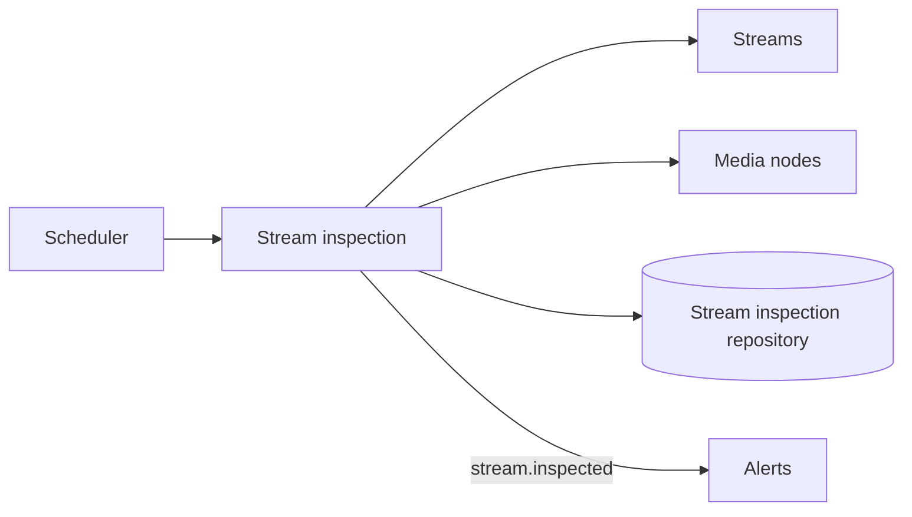

# Stream inspection

## Responsibility

Stream Inspection periodically captures MediaMTX path and track detail for every contextual
stream, persists an inspection-history record, emits the observation, and exposes history by
stream name.

## Boundaries

### Owns

- The configured `stream-inspection.inspect` job and per-stream inspection loop.
- Stream-inspection records, including observation time, tracks, and collection error.
- Target selection between a stream's assigned cluster node and origin ingest node.
- `stream.inspected` emission after a record is stored.

### Does not own

- Stream or node records, MediaMTX transport, or alert rules.
- Corrective stream action after an inspection error.
- Pipeline deployment or synchronization.

## Public surface

| Export or endpoint | Responsibility | Consumers |
|---|---|---|
| `StreamInspectionModule` | Wires job, query, controller, and repository; Nest-exports the query service | `AppModule` |
| `GET /api/stream-inspection` | Returns each stream's latest stored inspection | REST clients |
| `GET /api/stream-inspection/:streamName` | Returns the latest inspection for one stream | REST clients |
| `GET /api/stream-inspection/:streamName/history` | Returns limited history for one stream | REST clients |
| `StreamInspectionRepository` and domain types | Persistence contracts | Database infrastructure and feature services |

The query service is not in the feature-root barrel, and no current feature injects it.

## Entry points

- [`StreamInspectionCollectionService`](../../backend/src/stream-inspection/services/collection/stream-inspection-collection.service.ts)
  handles the fixed interval.
- [`StreamInspectionController`](../../backend/src/stream-inspection/controllers/stream-inspection.controller.ts)
  exposes history.
- The feature has no event handlers.

## Internal concerns

| Concern | Path | Responsibility |
|---|---|---|
| Collection | [`services/collection/`](../../backend/src/stream-inspection/services/collection/) | List streams, choose a node, inspect, persist, and emit |
| Query | [`services/query/`](../../backend/src/stream-inspection/services/query/) | Read history by stream |
| Domain | [`domain/`](../../backend/src/stream-inspection/domain/) | Inspection and new-record shapes |
| Persistence port | [`repositories/`](../../backend/src/stream-inspection/repositories/) | Append/read history contract |

## Owned data

| Entity or state | Contract | Persistence adapter | Ownership |
|---|---|---|---|
| Stream inspection history | [`StreamInspectionRepository`](../../backend/src/stream-inspection/repositories/stream-inspection.repository.ts) | [`mongo-stream-inspection.repository.ts`](../../backend/src/infrastructure/database/mongo/stream-inspection/mongo-stream-inspection.repository.ts), [`stream-inspection.schema.ts`](../../backend/src/infrastructure/database/mongo/stream-inspection/stream-inspection.schema.ts) | Stream Inspection owns observation/history semantics; Database owns Mongo mapping |

## Events

### Produces

| Event | Trigger | Payload type | Owner |
|---|---|---|---|
| `stream.inspected` | An inspection record, including an error record, is persisted | `StreamInspectedPayload` | `StreamInspectionCollectionService` |

### Consumes

The feature has no event handlers.

## Dependencies

## Primary flows

- [Stream inspection subsystem](../subsystems/stream-inspection.md)
- [Alert evaluation and reconciliation](../subsystems/alert-evaluation-and-reconciliation.md)

## Behavioral specifications

No canonical OpenSpec specification currently exists. See the
[specification map](../specification-map.md).

## Architecture decisions

- [ADR-0003: Data-driven track parsing](../adr/0003-data-driven-track-parsing.md) — Accepted.
- [ADR-0010: Event-driven alert pipeline](../adr/0010-event-driven-alert-pipeline.md) — Accepted.

## Governing conventions

See the [conventions registry](../../backend/CONVENTIONS.md).

| Rule | Relevance |
|---|---|
| `PHIL-01`, `ARCH-02`, `ARCH-04` | Feature ownership, scheduler, and event reaction boundary |
| `DATA-01`, `DATA-05` | Repository ownership and persistence correctness |
| `EVT-01`–`EVT-05` | Persist-then-emit typed inspection observation |
| `JOB-01`–`JOB-03` | Registered cadence and overlap/failure guard |
| `TEST-01`, `TEST-05`, `DOC-06` | Mirrored tests and documentation maintenance |

## Validation

- `cd backend && npm test -- --runInBand test/stream-inspection`
- `cd backend && npm run verify`
- `openspec validate --all`

## Known limitations

- The Mongo repository has no direct integration test.
- A MediaMTX stats failure is deliberately persisted/emitted as an error observation; the track
  ruler ignores it, so it cannot resolve an older track alert.
- Inspection history has no retention policy in the documented code.

## Evidence

| Claim | Implementation evidence | Test evidence |
|---|---|---|
| The collector targets assigned cluster nodes or origin ingest nodes | [`stream-inspection-collection.service.ts`](../../backend/src/stream-inspection/services/collection/stream-inspection-collection.service.ts) | [`stream-inspection-collection.service.test.ts`](../../backend/test/stream-inspection/services/collection/stream-inspection-collection.service.test.ts) |
| Stats failures become persisted error observations | [`stream-inspection-collection.service.ts`](../../backend/src/stream-inspection/services/collection/stream-inspection-collection.service.ts) | [`stream-inspection-collection.service.test.ts`](../../backend/test/stream-inspection/services/collection/stream-inspection-collection.service.test.ts) |
| History is queryable by stream | [`stream-inspection-query.service.ts`](../../backend/src/stream-inspection/services/query/stream-inspection-query.service.ts) | [`stream-inspection-query.service.test.ts`](../../backend/test/stream-inspection/services/query/stream-inspection-query.service.test.ts), [`stream-inspection.controller.test.ts`](../../backend/test/stream-inspection/controllers/stream-inspection.controller.test.ts) |
