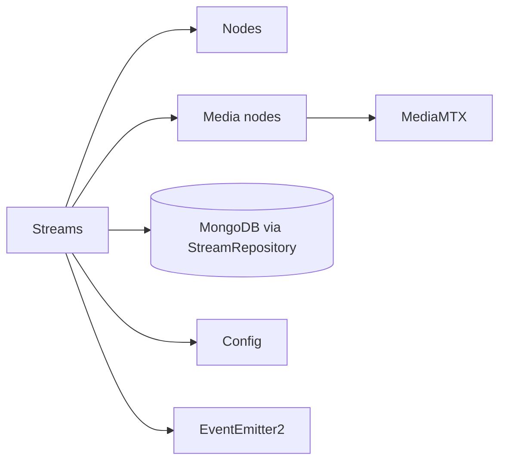

# Streams

## Responsibility

The Streams feature owns persisted stream records and their domain lifecycle. It provides manual
stream onboarding and CRUD, ingest publish reservation/authentication, deterministic cluster-node
assignment, guarded status transitions, and orchestration of cluster pull pipelines through the
Media Nodes feature.

## Boundaries

### Owns

- Stream creation, reservation, query, update, deletion, assignment, and status transitions.
- The `Stream` domain record, including embedded reservation and assignment fields.
- Legal lifecycle moves and compare-and-set retry through `StreamStatusService`.
- Selection inputs for ingest placement and cluster assignment; reservation and assignment
  persistence remain separate because one is birth-time state and one is a mutation.
- Stream lifecycle events emitted after owned mutations or pipeline outcomes.

### Does not own

- Which nodes are live or their addresses; [Nodes](nodes.md) owns registry state.
- MediaMTX clients or node operations; [Media nodes](media-nodes.md) and infrastructure own them.
- Periodic discovery, convergence, and stale cleanup; [Sync](sync.md) orchestrates those flows.
- Track inspection, operational metrics, alert evaluation, or WebSocket transport.

## Public surface

| Export or endpoint | Responsibility | Consumers |
|---|---|---|
| `StreamsModule` | Wires stream controllers/services; Nest-exports only the facade and query service | `AppModule`, Sync, Stream Inspection, Alerts |
| `StreamsFacadeService` | Supported multi-operation cross-feature facade | Sync, Stream Inspection |
| `StreamQueryService` | Supported read-only cross-feature service | Alerts |
| `StreamRepository` and domain types | Persistence port and compile-time contracts from the curated root barrel | `DatabaseModule`, Mongo adapter, dependent feature types |
| `GET/POST/PATCH/DELETE /api/streams...` | External query, manual onboarding, update/delete, assignment, and unassignment surface | REST clients |
| `POST /api/ingest/streams` | Reserve a publish slot and receive node coordinates/secret | Publishers |
| `POST /api/ingest/auth` | MediaMTX HTTP publish authorization | Ingest MediaMTX nodes |

`StreamStatusService`, `StreamAssignmentService`, and `StreamPipelineService` appear in the
feature-root barrel but are not exported by `StreamsModule`; they are not supported injectable
cross-feature services.

## Entry points

- [`StreamsController`](../../backend/src/streams/controllers/streams.controller.ts) exposes the
  manual/query REST surface.
- [`IngestController`](../../backend/src/streams/controllers/ingest.controller.ts) starts the
  reservation flow.
- [`IngestAuthController`](../../backend/src/streams/controllers/ingest-auth.controller.ts)
  handles MediaMTX publish authorization.
- `StreamsFacadeService` and `StreamQueryService` are direct cross-feature service entry points.
- The feature has no event handlers or scheduled jobs.

## Internal concerns

| Concern | Path | Responsibility |
|---|---|---|
| Assignment | [`services/assignment/`](../../backend/src/streams/services/assignment/) | Least-loaded ingest placement and deterministic cluster assignment |
| Mutation | [`services/mutation/`](../../backend/src/streams/services/mutation/) | CRUD plus the single lifecycle-transition authority |
| Orchestration | [`services/orchestration/`](../../backend/src/streams/services/orchestration/) | Reservation, manual setup, and cluster pipeline lifecycle |
| Query | [`services/query/`](../../backend/src/streams/services/query/) | Stream reads, assignment summaries, reservation counts, publish auth |
| Domain | [`domain/`](../../backend/src/streams/domain/) | Stream shapes and lifecycle transition table |
| Persistence port | [`repositories/`](../../backend/src/streams/repositories/) | Storage-independent stream operations |

## Owned data

| Entity or state | Contract | Persistence adapter | Ownership |
|---|---|---|---|
| Stream and embedded reservation/assignment state | [`Stream`](../../backend/src/streams/domain/types/stream.types.ts), [`StreamRepository`](../../backend/src/streams/repositories/stream.repository.ts) | [`MongoStreamRepository`](../../backend/src/infrastructure/database/mongo/stream/mongo-stream.repository.ts), [`StreamSchema`](../../backend/src/infrastructure/database/mongo/stream/stream.schema.ts) | Streams owns domain meaning and mutations; Database infrastructure owns Mongo mapping |

## Events

### Produces

| Event | Trigger | Payload type | Owner |
|---|---|---|---|
| `stream.reserved` | Reservation stored | No shared payload type; object `{ streamName, ingestNode, expiresAt }` | `StreamReservationService` |
| `stream.assigned` | Assignment transition succeeds | No shared payload type; assignment object | `StreamAssignmentService` |
| `stream.unassigned` | Unassignment transition succeeds | No shared payload type; stream name string | `StreamAssignmentService` |
| `stream.synced` | Pipeline deploy succeeds and status becomes synced | `Stream` (not declared in `event-payloads.types.ts`) | `StreamPipelineService` |
| `stream.removed` | Cluster pipeline teardown completes | Stream name string (not declared in `event-payloads.types.ts`) | `StreamPipelineService` |

### Consumes

The feature has no `@OnEvent` handlers.

## Dependencies

## Primary flows

- [Stream reservation and publication](../subsystems/stream-reservation-and-publication.md)
- [Stream assignment and pipeline deployment](../subsystems/stream-assignment-and-pipeline-deployment.md)
- [Synchronization and reconciliation](../subsystems/synchronization-and-reconciliation.md)
- [Realtime event broadcast](../subsystems/realtime-event-broadcast.md)

## Behavioral specifications

No canonical behavioral OpenSpec specification currently exists for this capability. The
canonical documentation-governance specification does not define Streams runtime behavior; see
the [specification map](../specification-map.md).

## Architecture decisions

- [ADR-0013: Reserve→publish ingestion on a per-node ingest cluster](../adr/0013-reserve-publish-ingest-cluster.md) — Accepted.
- [ADR-0014: Guard stream lifecycle transitions atomically](../adr/0014-guard-stream-lifecycle-transitions.md) — Accepted.
- [ADR-0004: Curated feature-root barrels](../adr/0004-curated-feature-root-barrels.md) — Accepted.
- [ADR-0009: Pod-derived cluster topology and targeting](../adr/0009-pod-derived-cluster-topology.md) — Accepted; ingest-relevant parts were superseded by ADR-0013.

## Governing conventions

See the [conventions registry](../../backend/CONVENTIONS.md).

| Rule | Relevance |
|---|---|
| `PHIL-01`, `DIR-01` | Feature-oriented ownership |
| `PHIL-05`, `SVC-04`, `TOOL-03` | Curated public surface and facade boundary |
| `DATA-01`, `ARCH-08` | Repository port and centralized Mongo binding |
| `DATA-07`, `SVC-07` | One guarded stream lifecycle authority |
| `INT-06` | Per-node ingest/cluster targeting |
| `EVT-01`, `EVT-05` | Mutation-owned events and typed payload requirement |
| `TEST-01`, `TEST-05` | Mirrored tests and cross-service coverage |
| `DOC-06` | Feature/subsystem documentation maintenance |

## Validation

- `cd backend && npm test -- --runInBand test/streams`
- `cd backend && npm run verify`
- `openspec validate --all` from the repository root

## Known limitations

- The duplicate-name reservation check is read-then-create; the unique name index is the only
  concurrent guard. The index is configured in the schema but has no live repository integration
  test, and deterministic HTTP 409 mapping for two racing reserves is not verified.
- Publish authorization checks the action, path, and stored secret, but does not directly check
  `reservedUntil`, the ingest-node identity, or the supplied username. An expired unused secret
  remains usable until Sync deletes the reservation; discovery clears the stored secret.
- Several produced stream events lack shared payload types, contrary to `EVT-05`.
- The two ingest controllers do not have direct controller tests; their services do.
- Manual stream deletion/disable does not have a verified cluster-pipeline teardown path.

## Evidence

| Claim | Implementation evidence | Test evidence |
|---|---|---|
| Lifecycle writes use one transition authority with compare-and-set retry | [`stream-status.service.ts`](../../backend/src/streams/services/mutation/stream-status.service.ts), [`mongo-stream.repository.ts`](../../backend/src/infrastructure/database/mongo/stream/mongo-stream.repository.ts) | [`stream-status.service.test.ts`](../../backend/test/streams/services/mutation/stream-status.service.test.ts) |
| Reservation persists birth-time ingest placement, a cleanup deadline, and a publish secret | [`stream-reservation.service.ts`](../../backend/src/streams/services/orchestration/stream-reservation.service.ts), [`stream-crud.service.ts`](../../backend/src/streams/services/mutation/stream-crud.service.ts) | [`stream-reservation.service.test.ts`](../../backend/test/streams/services/orchestration/stream-reservation.service.test.ts), [`publish-auth.service.test.ts`](../../backend/test/streams/services/query/publish-auth.service.test.ts) |
| Cluster assignment is sticky/deterministic for live candidates | [`stream-assignment.service.ts`](../../backend/src/streams/services/assignment/stream-assignment.service.ts) | [`stream-assignment.service.test.ts`](../../backend/test/streams/services/assignment/stream-assignment.service.test.ts) |
| Pipeline deployment targets the assigned cluster node and records success/error | [`stream-pipeline.service.ts`](../../backend/src/streams/services/orchestration/stream-pipeline.service.ts) | [`stream-pipeline.service.test.ts`](../../backend/test/streams/services/orchestration/stream-pipeline.service.test.ts) |
