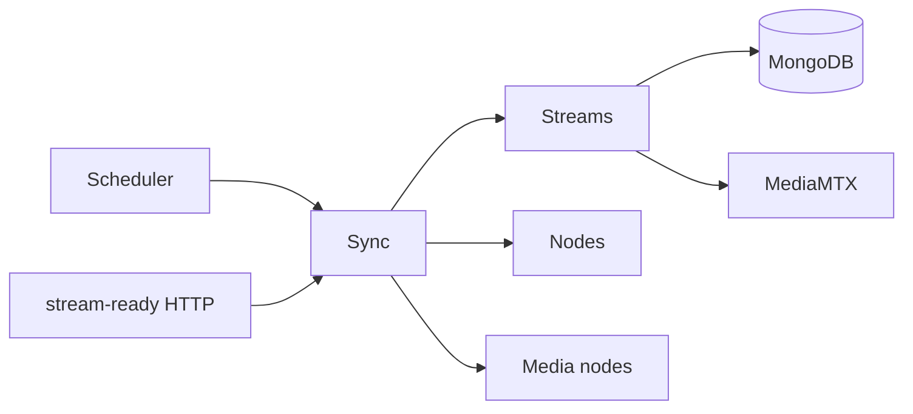

# Sync

## Responsibility

Sync orchestrates eventual convergence between MediaMTX observations and owned stream records.
It builds a shared snapshot, synchronizes discovered ingest streams, assigns/deploys eligible
streams, reconciles manual streams, and removes or expires stale state.

## Boundaries

### Owns

- The configured `sync.tick` interval and its re-entry guard.
- `POST /api/nodes/:nodeId/stream-ready` targeted activation.
- Snapshot construction and ordered, failure-isolated workflow execution.
- Decisions about discovery, staleness, reservation expiry, and when to ask Streams to mutate.

### Does not own

- Persisted data; mutations go through Streams.
- Node registry state or MediaMTX transport details.
- Stream lifecycle legality, assignment selection, or pipeline result transitions.

## Public surface

| Export or endpoint | Responsibility | Consumers |
|---|---|---|
| `SyncModule` | Wires controller, scheduler, context, orchestrator, and workflows; exports no providers | `AppModule` |
| `POST /api/nodes/:nodeId/stream-ready` | Reconciles one MediaMTX readiness notification | MediaMTX node integration |

The root barrel exposes only `SyncModule`; there is no injectable cross-feature API.

## Entry points

- [`SyncSchedulerService`](../../backend/src/sync/services/scheduler/sync-scheduler.service.ts)
  invokes periodic reconciliation.
- [`IngestActivationController`](../../backend/src/sync/controllers/ingest-activation.controller.ts)
  invokes targeted reconciliation.
- The feature has no event handlers.

## Internal concerns

| Concern | Path | Responsibility |
|---|---|---|
| Context | [`services/context/`](../../backend/src/sync/services/context/) | Build one ingest/cluster/node/stream observation snapshot |
| Orchestration | [`services/orchestration/`](../../backend/src/sync/services/orchestration/) | Order periodic and targeted workflows and isolate failures |
| Workflows | [`services/workflows/`](../../backend/src/sync/services/workflows/) | Discovery, manual reconciliation, assignment/deploy, and staleness |
| Scheduler | [`services/scheduler/`](../../backend/src/sync/services/scheduler/) | Interval and re-entry guard |

## Owned data

Sync owns no persisted entity. Its context and discovered-stream shapes are transient; Streams
owns every resulting record mutation.

## Events

### Produces

| Event | Trigger | Payload type | Owner |
|---|---|---|---|
| `sync.tick` | Periodic orchestration completes | No shared type; snapshot counts and failed-step names | `SyncOrchestratorService` |

Streams emits lifecycle events for mutations requested by Sync. `sync.tick` is not broadcast by
the Gateway.

### Consumes

The feature has no event handlers.

## Dependencies

## Primary flows

- [Synchronization and reconciliation](../subsystems/synchronization-and-reconciliation.md)
- [Stream assignment and pipeline deployment](../subsystems/stream-assignment-and-pipeline-deployment.md)
- [Stream reservation and publication](../subsystems/stream-reservation-and-publication.md)

## Behavioral specifications

No canonical OpenSpec specification currently exists. See the
[specification map](../specification-map.md).

## Architecture decisions

- [ADR-0009: Pod-derived cluster topology](../adr/0009-pod-derived-cluster-topology.md) — Accepted; terminology and static-fallback details are historical.
- [ADR-0013: Reserve→publish ingestion on a per-node ingest cluster](../adr/0013-reserve-publish-ingest-cluster.md) — Accepted; its recorded `/api/pods/...` path is now `/api/nodes/...`.
- [ADR-0014: Guard stream lifecycle transitions atomically](../adr/0014-guard-stream-lifecycle-transitions.md) — Accepted.

## Governing conventions

See the [conventions registry](../../backend/CONVENTIONS.md).

| Rule | Relevance |
|---|---|
| `PHIL-01`, `ARCH-02`, `ARCH-03` | Feature ownership, scheduler, and orchestration boundary |
| `ARCH-11`, `INT-01`–`INT-06` | Live topology and targeted integration behavior |
| `SVC-04`, `DATA-07` | Facade-only cross-feature mutation and guarded lifecycle authority |
| `EVT-05`, `JOB-01`–`JOB-03` | Payload typing and registered job behavior |
| `TEST-01`, `TEST-05`, `DOC-06` | Mirrored tests and documentation maintenance |

## Validation

- `cd backend && npm test -- --runInBand test/sync`
- `cd backend && npm run verify`
- `openspec validate --all`

## Known limitations

- The targeted endpoint accepts a path `nodeId` but does not verify that the notification came
  from that registered node or validate its role.
- Manual disable/delete has no verified path that always tears down an existing cluster pipeline.
- `sync.tick` has no shared payload type and reports snapshot sizes, not completed-work counts.
- When no cluster nodes are live, assignment/deploy work is skipped while cleanup still runs.

## Evidence

| Claim | Implementation evidence | Test evidence |
|---|---|---|
| Periodic work is guarded and failures do not escape the scheduler | [`sync-scheduler.service.ts`](../../backend/src/sync/services/scheduler/sync-scheduler.service.ts) | [`sync-scheduler.service.test.ts`](../../backend/test/sync/services/scheduler/sync-scheduler.service.test.ts) |
| One snapshot feeds ordered, failure-isolated workflows | [`sync-context-builder.service.ts`](../../backend/src/sync/services/context/sync-context-builder.service.ts), [`sync-orchestrator.service.ts`](../../backend/src/sync/services/orchestration/sync-orchestrator.service.ts) | [`sync-context-builder.service.test.ts`](../../backend/test/sync/services/context/sync-context-builder.service.test.ts), [`sync-orchestrator.service.test.ts`](../../backend/test/sync/services/orchestration/sync-orchestrator.service.test.ts) |
| Targeted activation records, assigns, and deploys one stream when possible | [`sync-orchestrator.service.ts`](../../backend/src/sync/services/orchestration/sync-orchestrator.service.ts), [`ingest-activation.controller.ts`](../../backend/src/sync/controllers/ingest-activation.controller.ts) | [`sync-orchestrator.service.test.ts`](../../backend/test/sync/services/orchestration/sync-orchestrator.service.test.ts), [`ingest-activation.controller.test.ts`](../../backend/test/sync/controllers/ingest-activation.controller.test.ts) |
| Staleness decisions use observed-node coverage and guarded reservation expiry | [`stream-staleness.service.ts`](../../backend/src/sync/services/workflows/stream-staleness.service.ts) | [`stream-staleness.service.test.ts`](../../backend/test/sync/services/workflows/stream-staleness.service.test.ts) |
