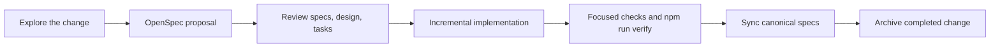

<!-- media-sync-ai-workflow:start -->
# Media Sync Engineering

This page is the repository's Obsidian and Markdown navigation dashboard. It does not
replace code, specifications, conventions, or ADRs.

## Start here

- [Backend engineering conventions](../backend/CONVENTIONS.md)
- [Spec-driven development method](methodology/spec-driven-development.md)
- [Architecture decisions](adr/)
- [Architecture documentation](architecture/)
- [Canonical behavioral specifications](../openspec/specs/)
- [Active OpenSpec changes](../openspec/changes/)
- [Claude Code instructions](../CLAUDE.md)
- [Codex instructions](../AGENTS.md)

## Authority map

| Artifact | Responsibility |
|---|---|
| `backend/CONVENTIONS.md` | Current backend engineering law |
| `docs/adr/` | Durable architectural and tooling decisions |
| `openspec/specs/` | Current intended observable behavior |
| `openspec/changes/` | Proposed behavior, design, and tasks |
| Code and tests | Current implementation and validation evidence |
| `docs/index.md` | Navigation only |

## Working flow

## Obsidian usage

Open the repository root as the vault so this dashboard can link to OpenSpec,
conventions, ADRs, Claude instructions, and Codex instructions together.

Use standard relative Markdown links. Keep `.obsidian/` local and uncommitted unless
the team later adopts a reviewed shared configuration. Use VS Code, Claude Code, or
Codex for TypeScript symbol navigation; Obsidian is the documentation and
specification interface.
<!-- media-sync-ai-workflow:end -->
