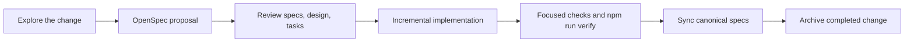

<!-- media-sync-ai-workflow:start -->
<!-- cspell:words openspec frontmatter -->

# Media Sync Engineering

This page is the repository's Obsidian and Markdown navigation dashboard. It does not
replace code, specifications, conventions, or ADRs.

## Start here

- [Glossary](glossary.md) — domain vocabulary, with links to where each term is defined
- [System overview](architecture/system-overview.md) — containers, layering, cross-cutting mechanisms
- [Specification map](specification-map.md) — capability inventory, baseline status, recorded conflicts
- [Backend engineering conventions](../backend/CONVENTIONS.md)
- [Architecture decisions](adr/index.md)
- [Spec-driven development method](methodology/spec-driven-development.md)

## Architecture

- [System overview](architecture/system-overview.md)
- [Module map](architecture/module-map.md) — every Nest module, its exports, its dependencies
- [Runtime flows](architecture/runtime-flows.md) — verified sequences; unverified ones marked as such
- [Validation and tooling](architecture/validation-and-tooling.md) — package roots, commands, what each gate proves

## Behavior

- [Specification map](specification-map.md)
- [Canonical behavioral specifications](../openspec/specs/) — empty until the first baseline is archived
- [Active OpenSpec changes](../openspec/changes/)
- [Baseline: node registry](../openspec/changes/baseline-node-registry-specification/specs/node-registry/spec.md)
- [Baseline: stream reservation](../openspec/changes/baseline-stream-reservation-specification/specs/stream-reservation/spec.md)

## Decisions and rules

- [ADR entry point](adr/index.md) · [ADR list](adr/README.md) · [ADR template](adr/template.md)
- [Backend engineering conventions](../backend/CONVENTIONS.md)

## Existing references

Reference documents, not behavioral authorities — check them against source and tests.

- [Backend README](../backend/README.md)
- [API documentation](../backend/API_DOCUMENTATION.md) — REST and WebSocket payload reference
- [System documentation](../backend/SYSTEM_DOCUMENTATION.md) — module design, data flows, deployment
- [Workspace README](../README.md) · [Setup](../SETUP.md)

## Agent instructions

- [Claude Code instructions](../CLAUDE.md)
- [Codex instructions](../AGENTS.md)

## Authority map

| Artifact | Responsibility |
|---|---|
| `backend/CONVENTIONS.md` | Current backend engineering law |
| `docs/adr/` | Durable architectural and tooling decisions |
| `openspec/specs/` | Current intended observable behavior |
| `openspec/changes/` | Proposed behavior, design, and tasks |
| Code and tests | Current implementation and validation evidence |
| `docs/architecture/`, `docs/glossary.md`, `docs/specification-map.md` | Human-facing orientation. Derived, never authoritative — each carries `last_verified` frontmatter and marks unverified claims |
| `backend/API_DOCUMENTATION.md`, `backend/SYSTEM_DOCUMENTATION.md` | Existing references. Predate the specifications; check against source and tests |
| `docs/index.md` | Navigation only |

When two sources disagree, do not pick one. Record the conflict in
[the specification map](specification-map.md) and name the artifact that must be reconciled.

## Working flow

## Obsidian usage

Open the repository root as the vault so this dashboard can link to OpenSpec,
conventions, ADRs, Claude instructions, and Codex instructions together.

Use standard relative Markdown links. Keep `.obsidian/` local and uncommitted unless
the team later adopts a reviewed shared configuration. Use VS Code, Claude Code, or
Codex for TypeScript symbol navigation; Obsidian is the documentation and
specification interface.
<!-- media-sync-ai-workflow:end -->
