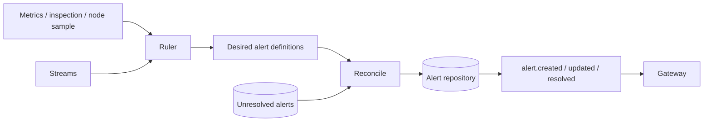

# Alert evaluation and reconciliation

## Purpose

Convert metric, track, and node-resource observations into a desired set of unresolved alerts and
converge persisted alert state to that set.

## Trigger

`metrics.collected`, `stream.inspected`, and `node.sampled` events trigger their respective ruler.
`PATCH /api/alerts/:id/resolve` triggers manual resolution.

## Participants

| Participant | Responsibility |
|---|---|
| Metrics | Produce persisted metric observation events |
| Stream Inspection | Produce persisted inspection events |
| Nodes | Produce optional resource-sample events |
| Streams | Supply stream context needed by track rules |
| Alerts | Derive desired identities and create, refresh, or resolve records |
| Gateway | Broadcast alert lifecycle events |

## End-to-end flow

## Responsibility boundaries

### Metrics

Provides persisted collection facts without creating alert records.

### Stream Inspection

Provides persisted track/detail observations without creating alert records.

### Nodes

Provides resource samples without creating alert records.

### Streams

Provides stream context needed by track rules.

### Alerts

Owns rule definitions, identity scope, persistence, and lifecycle event ownership.

### Gateway

Transports lifecycle facts without changing them.

## State transitions

| Initial state | Trigger | Resulting state | Owner | Evidence |
|---|---|---|---|---|
| No unresolved identity | Rule result desires identity | Open alert | Alerts | [`alert-reconcile.service.ts`](../../backend/src/alerts/services/reconciliation/alert-reconcile.service.ts) |
| Open identity | Identity remains desired | Refreshed open alert | Alerts | [`alert-reconcile.service.ts`](../../backend/src/alerts/services/reconciliation/alert-reconcile.service.ts) |
| Open identity | Identity is obsolete or manually resolved | Resolved alert | Alerts | [`alert-reconcile.service.ts`](../../backend/src/alerts/services/reconciliation/alert-reconcile.service.ts), [`alert-access.service.ts`](../../backend/src/alerts/services/access/alert-access.service.ts) |

## Persistence effects

| Write | Owner | Repository | Condition |
|---|---|---|---|
| Atomic create or refresh unresolved alert | Alerts | `AlertRepository` | Desired identity exists |
| Resolve unmatched unresolved alert | Alerts | `AlertRepository` | Identity is absent from desired scope |
| Resolve one alert manually | Alerts | `AlertRepository` | REST caller supplies an existing id |

The Mongo adapter enforces at most one unresolved `(source, subject, type)` identity with a
partial unique index.

## Events

| Event | Producer | Trigger | Consumers |
|---|---|---|---|
| `metrics.collected` | Metrics | Metric snapshot persisted | Alerts metric ruler |
| `stream.inspected` | Stream Inspection | Inspection persisted | Alerts track ruler, Gateway |
| `node.sampled` | Nodes | Registration/heartbeat includes resources | Alerts node ruler |
| `alert.created` | Alerts | New unresolved identity created | Gateway |
| `alert.updated` | Alerts | Existing unresolved identity refreshed | Gateway |
| `alert.resolved` | Alerts | Reconciliation/manual resolution succeeds | Gateway |

## Success behavior

Persisted unresolved alerts match the desired rule results for the reconciled source/subject
scope, and each lifecycle outcome emits its matching event.

## Failure behavior

| Failure | Expected behavior | Owner | Evidence |
|---|---|---|---|
| Rule predicate is false | Omit that desired alert | Alerts evaluator | [`alert-rule-evaluator.service.test.ts`](../../backend/test/alerts/services/evaluation/alert-rule-evaluator.service.test.ts) |
| Error/unknown stream inspection | Return without reconciliation | Alerts track ruler | [`track-alert-ruler.service.test.ts`](../../backend/test/alerts/services/rulers/track-alert-ruler.service.test.ts) |
| Atomic create races | Return one creator; only creator emits `alert.created` | Alerts repository/reconciler | [`alert-reconcile.service.test.ts`](../../backend/test/alerts/services/reconciliation/alert-reconcile.service.test.ts) |
| Repository/event handler error | Do not roll back producer persistence; fail handler independently | Alerts | [`alert-reconcile.service.ts`](../../backend/src/alerts/services/reconciliation/alert-reconcile.service.ts) |
| Node stops sampling | Receive no absence input; leave resource alert unchanged | Nodes / Alerts | [`node-resource-ruler.service.ts`](../../backend/src/alerts/services/rulers/node-resource-ruler.service.ts) |

## Idempotency

Stable alert identity plus atomic create/upsert makes repeated equivalent observations refresh one
unresolved record rather than create duplicates. Manual resolution is repository-defined and
returns the resulting alert when found.

## Concurrency and consistency

The partial unique index is the concurrency guard for unresolved identity. A full metric source
can reconcile all subjects, while inspection/node events reconcile one subject. Multi-alert
changes and lifecycle emissions are not one transaction.

## Operational considerations

Rule constants define thresholds. Missing observations are not uniformly proof of recovery:
metric full-source reconciliation can remove vanished desired identities, while ignored inspection
errors and absent node samples leave prior alerts unchanged.

## Related features

[Alerts](../features/alerts.md), [Metrics](../features/metrics.md),
[Stream inspection](../features/stream-inspection.md), [Nodes](../features/nodes.md),
[Streams](../features/streams.md), and [Gateway](../features/gateway.md).

## Behavioral specifications

No canonical behavioral OpenSpec exists; see the [specification map](../specification-map.md).

## Architecture decisions

[ADR-0003](../adr/0003-data-driven-track-parsing.md),
[ADR-0010](../adr/0010-event-driven-alert-pipeline.md), and
[ADR-0011](../adr/0011-node-resource-alerts-third-producer.md).

## Governing conventions

| Rule | Relevance |
|---|---|
| `ARCH-04` | Event-driven reaction avoids producer dependency on Alerts |
| `DATA-01`, `DATA-05` | Repository ownership and database-enforced alert identity |
| `EVT-01`–`EVT-05` | Producer/consumer and lifecycle event contracts |
| `TEST-05`, `DOC-06` | Cross-service evidence and subsystem maintenance |

See [`backend/CONVENTIONS.md`](../../backend/CONVENTIONS.md).

## Evidence

| Claim | Implementation | Test |
|---|---|---|
| Three producer families map observations to desired alert definitions | [`services/rulers/`](../../backend/src/alerts/services/rulers/) | [`services/rulers/`](../../backend/test/alerts/services/rulers/) |
| Reconciliation creates, refreshes, and resolves desired identities | [`alert-reconcile.service.ts`](../../backend/src/alerts/services/reconciliation/alert-reconcile.service.ts) | [`alert-reconcile.service.test.ts`](../../backend/test/alerts/services/reconciliation/alert-reconcile.service.test.ts) |
| Mongo enforces one unresolved stable identity | [`alert.schema.ts`](../../backend/src/infrastructure/database/mongo/alert/alert.schema.ts), [`mongo-alert.repository.ts`](../../backend/src/infrastructure/database/mongo/alert/mongo-alert.repository.ts) | [`alert-reconcile.service.test.ts`](../../backend/test/alerts/services/reconciliation/alert-reconcile.service.test.ts) |
