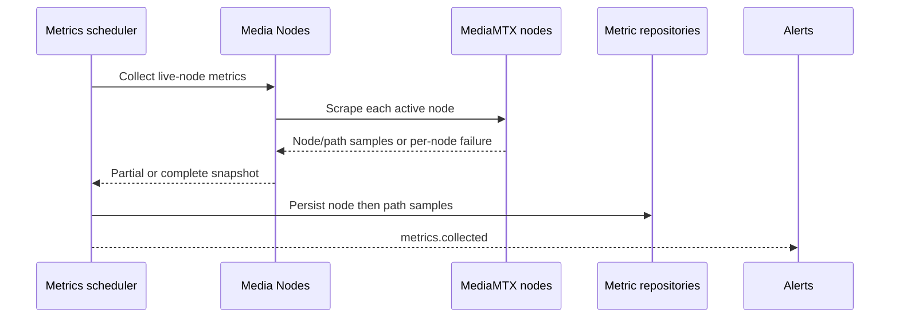

# Metrics collection

## Purpose

Sample operational metrics from every live MediaMTX node, retain node/path history, and reconcile
metric alerts from the persisted collection snapshot.

## Trigger

The configured `metrics.collect` fixed interval (default 10 seconds) invokes collection.

## Participants

| Participant | Responsibility |
|---|---|
| Metrics | Schedule collection, persist samples, emit the snapshot |
| Media Nodes | Resolve live targets, scrape each node, map loads, isolate per-node failures |
| Nodes | Supply active ingest and cluster registry entries |
| Alerts | Evaluate `metrics.collected` and reconcile desired metric alerts |

## End-to-end flow

## Responsibility boundaries

### Metrics

Owns cadence, records, persistence ordering, and the collection event.

### Media Nodes

Owns target resolution and scraping, not history or alert semantics.

### Nodes

Owns the live registry entries used as scrape targets.

### Alerts

Owns threshold rules and resulting alert lifecycle.

## State transitions

| Initial state | Trigger | Resulting state | Owner | Evidence |
|---|---|---|---|---|
| No records for this collection instant | Successful scrape/persistence | Node/path metric records appended | Metrics | [`metric-persistence.service.ts`](../../backend/src/metrics/services/persistence/metric-persistence.service.ts) |
| Existing metric-alert set | `metrics.collected` | Desired identities created/refreshed; obsolete identities resolved | Alerts | [`metric-alert-ruler.service.ts`](../../backend/src/alerts/services/rulers/metric-alert-ruler.service.ts) |

## Persistence effects

| Write | Owner | Repository | Condition |
|---|---|---|---|
| Append collected node samples | Metrics | `NodeMetricRepository` | Scrape returns node samples |
| Append collected path samples | Metrics | `PathMetricRepository` | Scrape returns path samples |
| Reconcile metric alerts | Alerts | `AlertRepository` | `metrics.collected` handler evaluates desired identities |

These are independent repository operations.

## Events

| Event | Producer | Trigger | Consumers |
|---|---|---|---|
| `metrics.collected` | Metrics | Node/path persistence succeeds | Alerts |

Gateway does not broadcast this internal observation.

## Success behavior

All successfully scraped samples are stored and one event exposes that same snapshot to alert
evaluation, even if an individual node scrape failed and was omitted.

## Failure behavior

| Failure | Expected behavior | Owner | Evidence |
|---|---|---|---|
| One node scrape fails | Log/isolate it; continue other nodes | Media Nodes | Implemented in [`media-mtx-metrics.service.ts`](../../backend/src/media-nodes/services/metrics/media-mtx-metrics.service.ts); no direct failure-path test |
| Collection-level failure | Log and clear the scheduler's in-process re-entry guard | Job scheduler | [`job-scheduler.service.test.ts`](../../backend/test/common/scheduling/job-scheduler.service.test.ts) |
| Node persistence fails | Do not complete path persistence/event | Metrics | [`metric-collection.service.test.ts`](../../backend/test/metrics/services/collection/metric-collection.service.test.ts) |
| Path persistence fails | Node batch may remain; suppress event | Metrics | [`metric-collection.service.ts`](../../backend/src/metrics/services/collection/metric-collection.service.ts) |
| Alert handler fails | Leave metric history persisted | Alerts | [`metric-alert-ruler.service.test.ts`](../../backend/test/alerts/services/rulers/metric-alert-ruler.service.test.ts) |

## Idempotency

Each interval intentionally appends a new observation; repeated snapshots are not deduplicated.
The in-process guard prevents overlapping executions in one service instance.

## Concurrency and consistency

Scrapes are independent and can represent slightly different instants. Node and path writes are
not one transaction, and alert reconciliation follows via the in-process event bus.

## Operational considerations

Cadence affects storage growth and scrape load. Per-node isolation favors partial visibility.
Zero-filled load derivation for an absent scrape is used by placement consumers and should not be
confused with a persisted proof that the node has zero work.

## Related features

[Metrics](../features/metrics.md), [Media nodes](../features/media-nodes.md),
[Nodes](../features/nodes.md), and [Alerts](../features/alerts.md).

## Behavioral specifications

No canonical behavioral OpenSpec exists; see the [specification map](../specification-map.md).

## Architecture decisions

[ADR-0001](../adr/0001-mediamtx-v3-api-behind-infrastructure-layer.md) and
[ADR-0010](../adr/0010-event-driven-alert-pipeline.md).

## Governing conventions

| Rule | Relevance |
|---|---|
| `ARCH-02`, `JOB-01`–`JOB-03` | Registered scheduled collection and run guard |
| `DATA-01`, `DATA-05` | Metric repository ownership and persistence correctness |
| `EVT-01`–`EVT-05` | Persisted typed observation drives alert reaction |
| `TEST-05`, `DOC-06` | Cross-service evidence and subsystem maintenance |

See [`backend/CONVENTIONS.md`](../../backend/CONVENTIONS.md).

## Evidence

| Claim | Implementation | Test |
|---|---|---|
| Collection persists before emitting its typed snapshot | [`metric-collection.service.ts`](../../backend/src/metrics/services/collection/metric-collection.service.ts) | [`metric-collection.service.test.ts`](../../backend/test/metrics/services/collection/metric-collection.service.test.ts) |
| Per-node scrape failures are isolated | [`media-mtx-metrics.service.ts`](../../backend/src/media-nodes/services/metrics/media-mtx-metrics.service.ts) | No direct failure-path test; [`media-mtx-metrics.service.test.ts`](../../backend/test/media-nodes/services/metrics/media-mtx-metrics.service.test.ts) covers load projection only |
| Metric observations drive desired-alert reconciliation | [`metric-alert-ruler.service.ts`](../../backend/src/alerts/services/rulers/metric-alert-ruler.service.ts) | [`metric-alert-ruler.service.test.ts`](../../backend/test/alerts/services/rulers/metric-alert-ruler.service.test.ts) |
