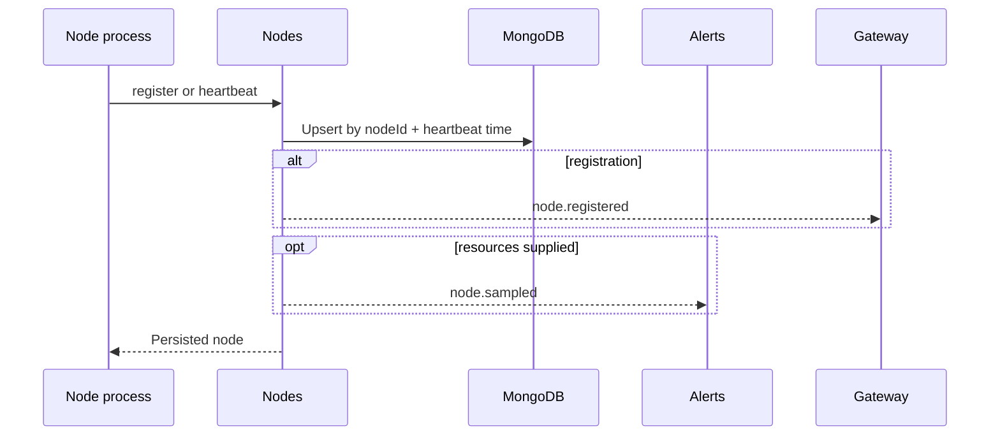

# Node registration and heartbeat

## Purpose

Maintain the node registry coordinates and freshness needed by topology consumers, and turn
optional reported resource utilization into internal alert observations.

## Trigger

Node processes call `POST /api/nodes/register` at startup and
`POST /api/nodes/heartbeat` during operation.

## Participants

| Participant | Responsibility |
|---|---|
| Nodes | Validate input, upsert registry state, derive live queries, emit facts |
| Alerts | Evaluate optional `node.sampled` resource payloads |
| Gateway | Broadcast `node.registered` to connected clients |

## End-to-end flow

## Responsibility boundaries

### Nodes

Owns registry writes, port defaults, and read-time liveness. It does not infer resource alerts.

### Alerts

Consumes samples and owns any resulting alert state.

### Gateway

Transports registration events only; heartbeats/resource samples are not broadcast.

## State transitions

| Initial state | Trigger | Resulting state | Owner | Evidence |
|---|---|---|---|---|
| No/current node record | Registration | Active node record with current coordinates/heartbeat | Nodes | [`node-lifecycle.service.ts`](../../backend/src/nodes/services/lifecycle/node-lifecycle.service.ts) |
| Current node record | Heartbeat | Same registry identity with refreshed heartbeat/resources | Nodes | [`node-lifecycle.service.ts`](../../backend/src/nodes/services/lifecycle/node-lifecycle.service.ts) |
| Active record older than cutoff | Live query | Persisted state unchanged; excluded from result | Nodes | [`node-query.service.ts`](../../backend/src/nodes/services/query/node-query.service.ts) |

`inactive` and `draining` exist but no current flow writes them.

## Persistence effects

| Write | Owner | Repository | Condition |
|---|---|---|---|
| Upsert registry coordinates/status/heartbeat | Nodes | `NodeRepository` | Valid registration |
| Refresh heartbeat and optional resources | Nodes | `NodeRepository` | Valid heartbeat |
| Create/update/resolve resource alert | Alerts | `AlertRepository` | `node.sampled` rule reconciliation requires it |

## Events

| Event | Producer | Trigger | Consumers |
|---|---|---|---|
| `node.registered` | Nodes | Registration upsert completes | Gateway |
| `node.sampled` | Nodes | Registration/heartbeat contains resources | Alerts |

## Success behavior

Registry state is current and consumers can resolve the node while its active status and
heartbeat age satisfy liveness rules.

## Failure behavior

| Failure | Expected behavior | Owner | Evidence |
|---|---|---|---|
| DTO validation fails | Reject before service mutation | Nest transport / Nodes | [`nodes.controller.ts`](../../backend/src/nodes/controllers/nodes.controller.ts) |
| Repository write fails | Fail request and emit no success event | Nodes | [`node-lifecycle.service.test.ts`](../../backend/test/nodes/services/lifecycle/node-lifecycle.service.test.ts) |
| Node becomes silent | Keep record but exclude it from live queries | Nodes | [`node-query.service.test.ts`](../../backend/test/nodes/services/query/node-query.service.test.ts) |
| Sample alert evaluation fails | Leave completed registry write intact; handler fails separately | Alerts | [`node-resource-ruler.service.test.ts`](../../backend/test/alerts/services/rulers/node-resource-ruler.service.test.ts) |

## Idempotency

Both calls upsert by `nodeId`; repeated valid calls update the same registry record. Registration
events can repeat because each successful registration call emits one.

## Concurrency and consistency

The repository's unique `nodeId` key converges concurrent upserts. Registry persistence and
event-driven alert/broadcast reactions do not share a transaction.

## Operational considerations

Heartbeat tolerance determines failure-detection latency. Nodes must report reachable host/ports;
Media Nodes has no static fallback. Unknown-node heartbeat upsert behavior is not integration-tested
against required schema fields.

## Related features

[Nodes](../features/nodes.md), [Alerts](../features/alerts.md), and
[Gateway](../features/gateway.md).

## Behavioral specifications

No canonical behavioral OpenSpec exists; see the [specification map](../specification-map.md).

## Architecture decisions

[ADR-0011](../adr/0011-node-resource-alerts-third-producer.md),
[ADR-0012](../adr/0012-cluster-nodes-as-statefulset.md), and
[ADR-0013](../adr/0013-reserve-publish-ingest-cluster.md).

## Governing conventions

| Rule | Relevance |
|---|---|
| `ARCH-11`, `INT-06` | Registry-owned runtime topology and per-node coordinates |
| `DATA-01` | Nodes-owned repository port and Mongo adapter boundary |
| `EVT-01`, `EVT-04`, `EVT-05` | Registration/resource facts and typed cross-feature reaction |
| `TEST-05`, `DOC-06` | Cross-service evidence and subsystem maintenance |

See [`backend/CONVENTIONS.md`](../../backend/CONVENTIONS.md).

## Evidence

| Claim | Implementation | Test |
|---|---|---|
| Registration/heartbeat upsert one registry identity | [`node-lifecycle.service.ts`](../../backend/src/nodes/services/lifecycle/node-lifecycle.service.ts), [`mongo-node.repository.ts`](../../backend/src/infrastructure/database/mongo/node/mongo-node.repository.ts) | [`node-lifecycle.service.test.ts`](../../backend/test/nodes/services/lifecycle/node-lifecycle.service.test.ts) |
| Liveness is a read-time heartbeat/status filter | [`node-query.service.ts`](../../backend/src/nodes/services/query/node-query.service.ts) | [`node-query.service.test.ts`](../../backend/test/nodes/services/query/node-query.service.test.ts) |
| Resource payloads feed node alert rules | [`node-resource-ruler.service.ts`](../../backend/src/alerts/services/rulers/node-resource-ruler.service.ts) | [`node-resource-ruler.service.test.ts`](../../backend/test/alerts/services/rulers/node-resource-ruler.service.test.ts) |
