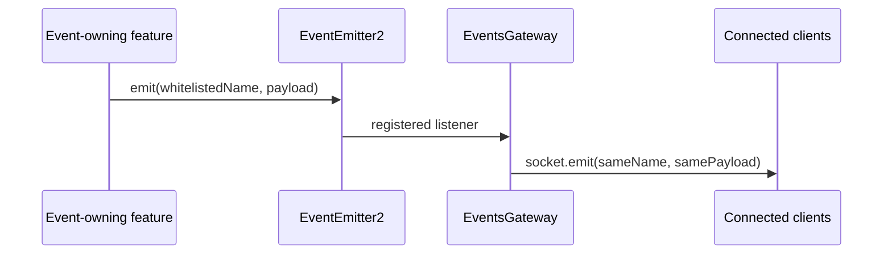

# Realtime event broadcast

## Purpose

Expose a deliberately selected subset of backend lifecycle/observation events to connected
Socket.IO clients without coupling event owners to WebSocket transport.

## Trigger

After Gateway initialization, any of its ten whitelisted EventEmitter2 event names triggers a
Socket.IO broadcast.

## Participants

| Participant | Responsibility |
|---|---|
| Streams | Emit selected reservation, assignment, sync, and removal facts |
| Alerts | Emit selected alert lifecycle facts |
| Stream Inspection | Emit selected inspection observations |
| Nodes | Emit selected registration facts |
| Gateway | Register listeners and broadcast name/payload verbatim |
| Socket.IO clients | Receive current live broadcasts |

## End-to-end flow

## Responsibility boundaries

### Streams

Owns the selected stream lifecycle events and payload meaning.

### Alerts

Owns the selected alert lifecycle events and payload meaning.

### Stream Inspection

Owns the selected inspection observation and payload meaning.

### Nodes

Owns the selected registration event and payload meaning.

### Gateway

Owns only selection and transport. It does not persist, transform, or acknowledge events.

### Socket.IO clients

Must treat delivery as live notification, not a durable source of truth.

## State transitions

| Initial state | Trigger | Resulting state | Owner | Evidence |
|---|---|---|---|---|
| N/A — no subsystem-owned domain state | Whitelisted event | Persisted/domain state remains unchanged | Event-owning feature | [`events.gateway.ts`](../../backend/src/gateway/events.gateway.ts) |

Broadcasts report transitions/observations that already occurred in owning features.

## Persistence effects

| Write | Owner | Repository | Condition |
|---|---|---|---|
| None | Gateway | None | Gateway stores no event log, cursor, acknowledgment, or replay buffer |

## Events

| Event | Producer | Trigger | Consumers |
|---|---|---|---|
| `stream.synced`, `stream.removed`, `stream.reserved`, `stream.assigned`, `stream.unassigned` | Streams | Owned stream lifecycle outcome | Gateway → Socket.IO clients |
| `alert.created`, `alert.updated`, `alert.resolved` | Alerts | Alert lifecycle outcome | Gateway → Socket.IO clients |
| `stream.inspected` | Stream Inspection | Inspection persisted | Alerts; Gateway → Socket.IO clients |
| `node.registered` | Nodes | Registration persisted | Gateway → Socket.IO clients |

`metrics.collected`, `node.sampled`, and `sync.tick` are not whitelisted.

## Success behavior

For a whitelisted in-process event after initialization, the gateway invokes Socket.IO emit once
with the same event name and payload reference/value.

## Failure behavior

| Failure | Expected behavior | Owner | Evidence |
|---|---|---|---|
| Event is not whitelisted | Register no listener/broadcast | Gateway | [`events.gateway.test.ts`](../../backend/test/gateway/events.gateway.test.ts) |
| Server/listener not initialized | Provide no durable recovery | Gateway | [`events.gateway.ts`](../../backend/src/gateway/events.gateway.ts) |
| No connected client | Retain no event for later clients | Gateway / Socket.IO | [`events.gateway.ts`](../../backend/src/gateway/events.gateway.ts) |
| Client disconnect/transport loss | Perform no application-level retry/ack | Gateway / client | [`events.gateway.ts`](../../backend/src/gateway/events.gateway.ts) |
| Payload lacks shared type | Forward it verbatim without enforcing compatibility | Event owner / Gateway | [`events.gateway.test.ts`](../../backend/test/gateway/events.gateway.test.ts) |

## Idempotency

Gateway performs one broadcast per received listener invocation and has no deduplication key.
Duplicate source events produce duplicate broadcasts.

## Concurrency and consistency

Delivery follows the in-process emitter and Socket.IO runtime. There is no cross-event
transaction, durable ordering guarantee, or consistency check against persisted state.

## Operational considerations

Clients should refresh authoritative REST/state after gaps or reconnects. Adding an event to the
system event constants does not expose it automatically; the Gateway whitelist and tests must be
updated deliberately.

## Related features

[Gateway](../features/gateway.md), [Streams](../features/streams.md),
[Alerts](../features/alerts.md), [Stream inspection](../features/stream-inspection.md), and
[Nodes](../features/nodes.md).

## Behavioral specifications

No canonical behavioral OpenSpec exists; see the [specification map](../specification-map.md).

## Architecture decisions

[ADR-0010](../adr/0010-event-driven-alert-pipeline.md) and
[ADR-0004](../adr/0004-curated-feature-root-barrels.md).

## Governing conventions

| Rule | Relevance |
|---|---|
| `PHIL-05` | Curated transport surface |
| `EVT-01`–`EVT-05` | Event ownership, internal/broadcast split, and payload contracts |
| `TEST-01` | Mirrored gateway coverage |
| `DOC-06` | Subsystem documentation maintenance |

See [`backend/CONVENTIONS.md`](../../backend/CONVENTIONS.md).

## Evidence

| Claim | Implementation | Test |
|---|---|---|
| Exactly ten events are whitelisted | [`events.gateway.ts`](../../backend/src/gateway/events.gateway.ts), [`system-event-names.const.ts`](../../backend/src/common/domain/consts/system-event-names.const.ts) | [`events.gateway.test.ts`](../../backend/test/gateway/events.gateway.test.ts) |
| Name/payload are broadcast unchanged | [`events.gateway.ts`](../../backend/src/gateway/events.gateway.ts) | [`events.gateway.test.ts`](../../backend/test/gateway/events.gateway.test.ts) |
| Internal observation events remain off the client transport | [`events.gateway.ts`](../../backend/src/gateway/events.gateway.ts) | [`events.gateway.test.ts`](../../backend/test/gateway/events.gateway.test.ts) |
