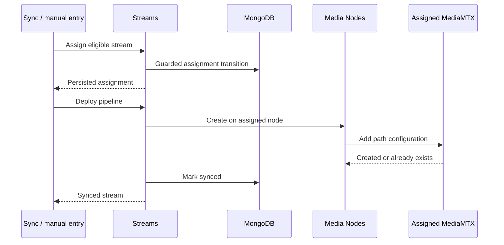

# Stream assignment and pipeline deployment

## Purpose

Choose a live cluster node for an eligible stream, persist that assignment through guarded stream
state, and create the MediaMTX pull pipeline that makes the stream available on the cluster.

## Trigger

Periodic or targeted Sync reconciliation requests assignment/deployment for an observed ingest
stream. Manual stream creation can invoke the same Streams-owned orchestration.

## Participants

| Participant | Responsibility |
|---|---|
| Sync | Determine when a contextual stream requires assignment/deployment |
| Streams | Select/persist assignment, enforce lifecycle transitions, own result events |
| Media Nodes | Resolve the assigned node and create/delete MediaMTX pipeline configuration |
| Cluster MediaMTX | Host the pull pipeline |

## End-to-end flow

## Responsibility boundaries

### Sync

Owns orchestration timing and candidate iteration, not assignment/state mutation.

### Streams

Owns deterministic assignment, legal transitions, and mapping pipeline outcomes to stream state.

### Media Nodes

Owns targeted MediaMTX calls and operation-level idempotency; it does not mutate Streams data.

### Cluster MediaMTX

Owns the external pull-path configuration requested through Media Nodes.

## State transitions

| Initial state | Trigger | Resulting state | Owner | Evidence |
|---|---|---|---|---|
| `created`, `discovered`, or `pending_assignment` | Assignment succeeds | `assigned` with cluster node | Streams | [`stream-assignment.service.ts`](../../backend/src/streams/services/assignment/stream-assignment.service.ts) |
| `assigned` or `sync_error` | Pipeline create succeeds/already exists | `synced` | Streams | [`stream-pipeline.service.ts`](../../backend/src/streams/services/orchestration/stream-pipeline.service.ts) |
| `assigned` or `synced` | Pipeline create fails | `sync_error` | Streams | [`stream-pipeline.service.ts`](../../backend/src/streams/services/orchestration/stream-pipeline.service.ts) |
| Assigned lifecycle state | Unassignment succeeds | `pending_assignment` with no node | Streams | [`stream-assignment.service.ts`](../../backend/src/streams/services/assignment/stream-assignment.service.ts) |

## Persistence effects

| Write | Owner | Repository | Condition |
|---|---|---|---|
| Assignment/node and guarded lifecycle version | Streams | `StreamRepository` | Candidate chosen and transition accepted |
| Synced or sync-error lifecycle result | Streams | `StreamRepository` | MediaMTX create result is known |
| External path configuration | Media Nodes / MediaMTX | MediaMTX API | Assigned target resolves and create/delete is invoked |

Sync and Media Nodes own no local persisted entity.

## Events

| Event | Producer | Trigger | Consumers |
|---|---|---|---|
| `stream.assigned` | Streams | Assignment transition succeeds | Gateway |
| `stream.unassigned` | Streams | Unassignment transition succeeds | Gateway |
| `stream.synced` | Streams | Pipeline success is persisted | Gateway |
| `stream.removed` | Streams | Pipeline teardown completes | Gateway |

## Success behavior

The stream record identifies a live cluster node, that node has the pull pipeline, and Streams
records a synced lifecycle state.

## Failure behavior

| Failure | Expected behavior | Owner | Evidence |
|---|---|---|---|
| No live cluster nodes | Skip/fail without inventing a target | Sync / Streams | [`sync-orchestrator.service.test.ts`](../../backend/test/sync/services/orchestration/sync-orchestrator.service.test.ts) |
| Guarded transition conflict | Reload/revalidate once, then conflict if still lost | Streams | [`stream-status.service.test.ts`](../../backend/test/streams/services/mutation/stream-status.service.test.ts) |
| MediaMTX create returns 409 | Treat as already-present success | Media Nodes | [`media-mtx-pipeline.service.test.ts`](../../backend/test/media-nodes/services/pipeline/media-mtx-pipeline.service.test.ts) |
| Other create failure | Record sync error; caller follows orchestration isolation | Streams | [`stream-pipeline.service.test.ts`](../../backend/test/streams/services/orchestration/stream-pipeline.service.test.ts) |
| Teardown returns 404 | Treat as already-absent success | Media Nodes | [`media-mtx-pipeline.service.test.ts`](../../backend/test/media-nodes/services/pipeline/media-mtx-pipeline.service.test.ts) |
| Other teardown failures | Complete fan-out, then report failures | Media Nodes | [`media-mtx-pipeline.service.test.ts`](../../backend/test/media-nodes/services/pipeline/media-mtx-pipeline.service.test.ts) |

## Idempotency

Existing valid assignments are sticky. Deterministic selection stabilizes new placement for the
same candidate set. MediaMTX 409/404 mappings make repeated create/delete requests convergent.

## Concurrency and consistency

Stream changes use versioned compare-and-set transitions, but Mongo state and the external
MediaMTX configuration do not share a transaction. A process failure between them can leave
temporary divergence for later reconciliation.

## Operational considerations

Availability depends on live cluster-node registry data and MediaMTX reachability. Teardown fans
out because stale pipeline configuration may exist on a node other than the current assignment.

## Related features

[Streams](../features/streams.md), [Media nodes](../features/media-nodes.md), and
[Sync](../features/sync.md).

## Behavioral specifications

No canonical behavioral OpenSpec exists; see the [specification map](../specification-map.md).

## Architecture decisions

[ADR-0009](../adr/0009-pod-derived-cluster-topology.md),
[ADR-0012](../adr/0012-cluster-nodes-as-statefulset.md),
[ADR-0013](../adr/0013-reserve-publish-ingest-cluster.md), and
[ADR-0014](../adr/0014-guard-stream-lifecycle-transitions.md).

## Governing conventions

| Rule | Relevance |
|---|---|
| `ARCH-11`, `INT-01`–`INT-06` | Live topology and targeted external operation boundary |
| `DATA-07` | Versioned guarded lifecycle transitions |
| `EVT-01` | Streams owns lifecycle event timing |
| `TEST-05`, `DOC-06` | Cross-service evidence and subsystem maintenance |

See [`backend/CONVENTIONS.md`](../../backend/CONVENTIONS.md).

## Evidence

| Claim | Implementation | Test |
|---|---|---|
| Assignment is sticky/deterministic for live candidates | [`stream-assignment.service.ts`](../../backend/src/streams/services/assignment/stream-assignment.service.ts) | [`stream-assignment.service.test.ts`](../../backend/test/streams/services/assignment/stream-assignment.service.test.ts) |
| Pipeline outcomes update stream lifecycle | [`stream-pipeline.service.ts`](../../backend/src/streams/services/orchestration/stream-pipeline.service.ts) | [`stream-pipeline.service.test.ts`](../../backend/test/streams/services/orchestration/stream-pipeline.service.test.ts) |
| MediaMTX create/delete operations have convergent 409/404 handling | [`media-mtx-pipeline.service.ts`](../../backend/src/media-nodes/services/pipeline/media-mtx-pipeline.service.ts) | [`media-mtx-pipeline.service.test.ts`](../../backend/test/media-nodes/services/pipeline/media-mtx-pipeline.service.test.ts) |
