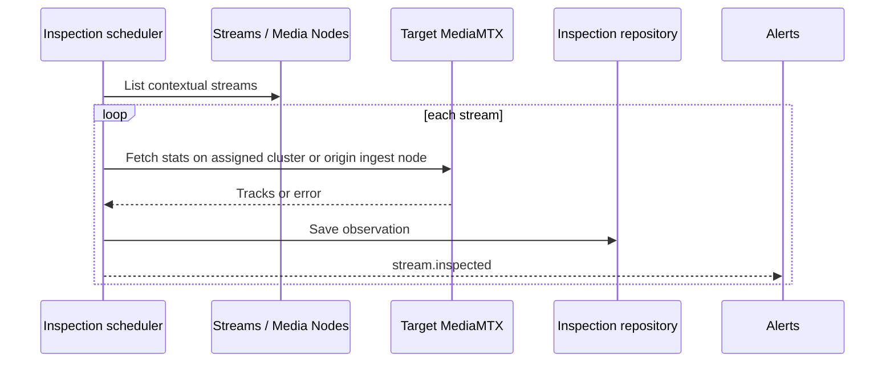

# Stream inspection

## Purpose

Capture per-stream MediaMTX detail and tracks as queryable history, including represented
collection errors, and feed successful observations to track-alert reconciliation.

## Trigger

The configured stream-inspection interval (default 30 seconds) starts a collection pass.

## Participants

| Participant | Responsibility |
|---|---|
| Stream Inspection | Schedule, target, persist, emit, and query observations |
| Streams | Provide contextual stream records and placement |
| Media Nodes | List contextual streams and fetch targeted stats |
| Alerts | Evaluate successful `stream.inspected` track observations |

## End-to-end flow

## Responsibility boundaries

### Stream Inspection

Owns historical observations and error representation, not stream lifecycle.

### Streams

Supplies stream context/placement without owning the inspection record.

### Media Nodes

Lists contextual paths and fetches external details from the chosen node.

### Alerts

Owns the decision to ignore failed/unknown-stream observations and any track-alert state.

## State transitions

| Initial state | Trigger | Resulting state | Owner | Evidence |
|---|---|---|---|---|
| No record for this inspection attempt | Per-stream attempt completes | Inspection record with tracks or `lastError` appended | Stream Inspection | [`stream-inspection-collection.service.ts`](../../backend/src/stream-inspection/services/collection/stream-inspection-collection.service.ts) |
| Existing track-alert set | Successful known-stream inspection | Desired identities created/refreshed; obsolete identities resolved | Alerts | [`track-alert-ruler.service.ts`](../../backend/src/alerts/services/rulers/track-alert-ruler.service.ts) |

The collector does not change stream lifecycle state.

## Persistence effects

| Write | Owner | Repository | Condition |
|---|---|---|---|
| Append track/detail or error observation | Stream Inspection | `StreamInspectionRepository` | MediaMTX lookup returns or is represented as an error |
| Reconcile track alerts | Alerts | `AlertRepository` | Observation succeeded and stream context exists |

An exception that prevents repository save produces no record/event for that item.

## Events

| Event | Producer | Trigger | Consumers |
|---|---|---|---|
| `stream.inspected` | Stream Inspection | Inspection record save succeeds | Alerts, Gateway |

## Success behavior

Each contextual stream receives a stored observation and event; successful stats include mapped
track details queryable by stream name.

## Failure behavior

| Failure | Expected behavior | Owner | Evidence |
|---|---|---|---|
| MediaMTX stats lookup fails | Store an error observation with empty tracks, then emit it | Stream Inspection | [`stream-inspection-collection.service.test.ts`](../../backend/test/stream-inspection/services/collection/stream-inspection-collection.service.test.ts) |
| One stream's save/processing fails | Log/isolate the item and continue others | Stream Inspection | [`stream-inspection-collection.service.test.ts`](../../backend/test/stream-inspection/services/collection/stream-inspection-collection.service.test.ts) |
| Stream context unavailable to ruler | Ignore the event for alert reconciliation | Alerts | [`track-alert-ruler.service.test.ts`](../../backend/test/alerts/services/rulers/track-alert-ruler.service.test.ts) |
| Observation contains `lastError` | Leave prior track alerts unchanged | Alerts | [`track-alert-ruler.service.test.ts`](../../backend/test/alerts/services/rulers/track-alert-ruler.service.test.ts) |

## Idempotency

Each interval intentionally appends history; equal observations are not deduplicated. The
scheduled collector uses a local re-entry guard.

## Concurrency and consistency

Streams are inspected independently and can change during the pass. Observation persistence
precedes event delivery, but alert persistence and WebSocket broadcast are not transactional with
the inspection record.

## Operational considerations

Cadence controls MediaMTX load and history growth. Persisting failures preserves diagnosis, while
the alert ruler's ignore behavior avoids treating missing data as proof of healthy tracks.

## Related features

[Stream inspection](../features/stream-inspection.md), [Streams](../features/streams.md),
[Media nodes](../features/media-nodes.md), and [Alerts](../features/alerts.md).

## Behavioral specifications

No canonical behavioral OpenSpec exists; see the [specification map](../specification-map.md).

## Architecture decisions

[ADR-0003](../adr/0003-data-driven-track-parsing.md) and
[ADR-0010](../adr/0010-event-driven-alert-pipeline.md).

## Governing conventions

| Rule | Relevance |
|---|---|
| `ARCH-02`, `JOB-01`–`JOB-03` | Registered scheduled inspection and run guard |
| `DATA-01`, `DATA-05` | Inspection repository ownership and persistence correctness |
| `EVT-01`–`EVT-05` | Persisted typed observation drives alert reaction |
| `TEST-05`, `DOC-06` | Cross-service evidence and subsystem maintenance |

See [`backend/CONVENTIONS.md`](../../backend/CONVENTIONS.md).

## Evidence

| Claim | Implementation | Test |
|---|---|---|
| Each successful save produces a typed inspection event | [`stream-inspection-collection.service.ts`](../../backend/src/stream-inspection/services/collection/stream-inspection-collection.service.ts) | [`stream-inspection-collection.service.test.ts`](../../backend/test/stream-inspection/services/collection/stream-inspection-collection.service.test.ts) |
| Stats calls target the stream's assigned/origin node | [`media-mtx-stream-stats.service.ts`](../../backend/src/media-nodes/services/stats/media-mtx-stream-stats.service.ts) | [`stream-inspection-collection.service.test.ts`](../../backend/test/stream-inspection/services/collection/stream-inspection-collection.service.test.ts) |
| Error/unknown-stream observations do not alter track alerts | [`track-alert-ruler.service.ts`](../../backend/src/alerts/services/rulers/track-alert-ruler.service.ts) | [`track-alert-ruler.service.test.ts`](../../backend/test/alerts/services/rulers/track-alert-ruler.service.test.ts) |
