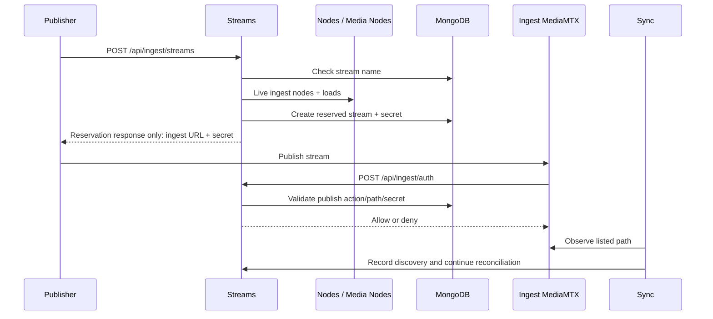

# Stream reservation and publication

## Purpose

Reserve a unique stream name on a least-loaded live ingest node, deliver a publish secret only in
the reservation response, authorize MediaMTX callbacks, keep that secret out of general stream
responses, and hand observed publication to synchronization.

## Trigger

`POST /api/ingest/streams` begins reservation. MediaMTX subsequently calls
`POST /api/ingest/auth`, and publication becomes observable through periodic listing or the
targeted stream-ready callback.

## Participants

| Participant | Responsibility |
|---|---|
| Streams | Validate uniqueness, select placement, persist reservation, authorize publication |
| Nodes | Supply live ingest-node records |
| Media Nodes | Resolve ingest coordinates and operational loads |
| MediaMTX ingest node | Accept and expose the authorized published path |
| Sync | Discover the path and advance it toward cluster assignment |

## End-to-end flow

## Responsibility boundaries

### Streams

Owns reservation identity, placement persistence, publish secret, expiry, authorization, and the
explicit credential-free projection used by every general Streams response. The internal record
retains the token; only `POST /api/ingest/streams` returns it to a publisher.

### Nodes

Provides current live ingest topology; it does not mutate the stream record.

### Media Nodes

Provides load and address operations over those live nodes.

### MediaMTX ingest node

Hosts the authorized publication and exposes the observed path.

### Sync

Interprets observation and requests later lifecycle changes.

## State transitions

| Initial state | Trigger | Resulting state | Owner | Evidence |
|---|---|---|---|---|
| No stream record | Reservation accepted | `reserved` record | Streams | [`stream-reservation.service.ts`](../../backend/src/streams/services/orchestration/stream-reservation.service.ts) |
| `reserved` | Sync observes publication | `discovered` | Streams | [`ingest-stream-synchronizer.service.ts`](../../backend/src/sync/services/workflows/ingest-stream-synchronizer.service.ts) |
| Expired `reserved` | Staleness confirms expiry/absence | Record deleted | Streams | [`stream-staleness.service.ts`](../../backend/src/sync/services/workflows/stream-staleness.service.ts) |

## Persistence effects

| Write | Owner | Repository | Condition |
|---|---|---|---|
| Create reserved stream with ingest node, expiry, and secret | Streams | `StreamRepository` | Unique name and live ingest placement selected |
| Promote reservation to discovered and clear reservation fields | Streams | `StreamRepository` | Sync observes the matching published path |
| Delete expired reservation | Streams | `StreamRepository` | Guarded staleness/expiry check succeeds |

Authorization is read-only.

## Events

| Event | Producer | Trigger | Consumers |
|---|---|---|---|
| `stream.reserved` | Streams | Reserved record created | Gateway |

Later assignment/pipeline events belong to their respective subsystem.

## Success behavior

The caller receives coordinates and a secret for the persisted ingest placement only from the
reservation endpoint. Its `publishUrl` contains the same token returned in `publishToken`. A
matching stored secret is accepted while it remains on the record, the published path can be
observed by Sync, and later general stream reads or mutations return safe fields without the token.

## Failure behavior

| Failure | Expected behavior | Owner | Evidence |
|---|---|---|---|
| Duplicate name observed | Reject before creation | Streams | [`stream-reservation.service.ts`](../../backend/src/streams/services/orchestration/stream-reservation.service.ts) |
| No live ingest node | Fail without creating a record | Streams | [`stream-reservation.service.test.ts`](../../backend/test/streams/services/orchestration/stream-reservation.service.test.ts) |
| Load/coordinate lookup fails | Fail without returning a successful reservation | Streams / Media Nodes | [`stream-reservation.service.ts`](../../backend/src/streams/services/orchestration/stream-reservation.service.ts) |
| Non-publish action, missing path/record/token, or wrong secret | Deny publish authorization | Streams | [`publish-auth.service.test.ts`](../../backend/test/streams/services/query/publish-auth.service.test.ts) |
| Publication never appears | Guardedly delete after expiry/absence is confirmed | Sync / Streams | [`stream-staleness.service.test.ts`](../../backend/test/sync/services/workflows/stream-staleness.service.test.ts) |

## Idempotency

The stream-name unique index prevents two persisted records. The API is not an idempotency-key
protocol: retrying after success encounters the existing name.

## Concurrency and consistency

The duplicate check and create are separate operations. The unique index is the final concurrent
guard, but it has no live repository integration test and deterministic mapping of a racing
duplicate-key error to HTTP 409 is not verified. Publish authorization does not directly check
`reservedUntil`, ingest-node identity, or username; an expired unused token remains valid until
Sync cleanup deletes the record, while discovery clears the token. Node load and
pending-reservation counts are snapshots, so placement is intentionally approximate.

## Operational considerations

Reservation cleanup limits unused secrets, subject to Sync cadence and successful expiry deletion.
Liveness/load accuracy depends on node heartbeat and metric cadence. Publication authorization
depends on the persisted path and secret, not a direct caller-node identity check.

Clients must retain the credential from the reservation response. General list, lookup, create,
update, assignment, and unassignment responses deliberately cannot be used to recover it.

## Related features

[Streams](../features/streams.md), [Nodes](../features/nodes.md),
[Media nodes](../features/media-nodes.md), and [Sync](../features/sync.md).

## Behavioral specifications

[`public-stream-contract`](../../openspec/changes/secure-public-stream-contract/specs/public-stream-contract/spec.md) defines the
general-response secrecy boundary and the intentional reservation delivery exception. See the
[specification map](../specification-map.md) for the repository-wide capability index.

## Architecture decisions

[ADR-0013](../adr/0013-reserve-publish-ingest-cluster.md),
[ADR-0014](../adr/0014-guard-stream-lifecycle-transitions.md), and
[ADR-0021](../adr/0021-secure-public-stream-contract.md). ADR-0021 complements ADR-0013: the
former owns the general-response boundary and the latter owns credential creation and delivery.

## Governing conventions

| Rule | Relevance |
|---|---|
| `ARCH-11`, `INT-06` | Live registry topology and per-node targeting |
| `ARCH-01`, `DATA-06`, `TYPE-03` | Explicit controller projection from internal to public stream shape |
| `DATA-07` | Guarded lifecycle authority after birth-state creation |
| `EVT-01`, `EVT-05` | Mutation-owned reservation event and payload typing |
| `TEST-05`, `DOC-06` | Cross-service evidence and subsystem maintenance |

See [`backend/CONVENTIONS.md`](../../backend/CONVENTIONS.md).

## Evidence

| Claim | Implementation | Test |
|---|---|---|
| General stream responses omit the internally persisted publish token | [`streams.controller.ts`](../../backend/src/streams/controllers/streams.controller.ts), [`map-stream-to-public-stream.mapper.ts`](../../backend/src/streams/controllers/map-stream-to-public-stream.mapper.ts) | [`streams.controller.test.ts`](../../backend/test/streams/controllers/streams.controller.test.ts) |
| Reservation response deliberately retains the token and credential-bearing URL | [`ingest.controller.ts`](../../backend/src/streams/controllers/ingest.controller.ts), [`stream-reservation.service.ts`](../../backend/src/streams/services/orchestration/stream-reservation.service.ts) | [`ingest.controller.test.ts`](../../backend/test/streams/controllers/ingest.controller.test.ts), [`stream-reservation.service.test.ts`](../../backend/test/streams/services/orchestration/stream-reservation.service.test.ts) |
| Reservation selects/persists an ingest placement and secret | [`stream-reservation.service.ts`](../../backend/src/streams/services/orchestration/stream-reservation.service.ts) | [`stream-reservation.service.test.ts`](../../backend/test/streams/services/orchestration/stream-reservation.service.test.ts) |
| Publish authorization checks the action/path and persisted publish token | [`publish-auth.service.ts`](../../backend/src/streams/services/query/publish-auth.service.ts) | [`publish-auth.service.test.ts`](../../backend/test/streams/services/query/publish-auth.service.test.ts) |
| Observation promotes a reserved stream without regressing newer states | [`ingest-stream-synchronizer.service.ts`](../../backend/src/sync/services/workflows/ingest-stream-synchronizer.service.ts) | [`ingest-stream-synchronizer.service.test.ts`](../../backend/test/sync/services/workflows/ingest-stream-synchronizer.service.test.ts) |
