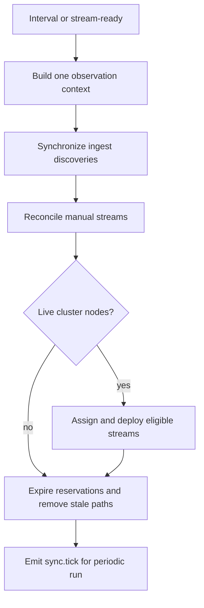

# Synchronization and reconciliation

## Purpose

Converge persisted stream state and cluster pipelines toward the streams currently observed on
live ingest/cluster nodes, while safely expiring reservations and removing stale cluster paths.

## Trigger

The configured Sync interval (default 10 seconds) starts full reconciliation. A MediaMTX callback
to `POST /api/nodes/:nodeId/stream-ready` starts targeted activation for one stream.

## Participants

| Participant | Responsibility |
|---|---|
| Sync | Build context, order workflows, isolate failures, decide staleness |
| Streams | Query and mutate stream records, assignment, lifecycle, and pipelines |
| Nodes | Provide live topology |
| Media Nodes | List observations, report coverage, operate MediaMTX |

## End-to-end flow

## Responsibility boundaries

### Sync

Owns observation context and workflow policy. Its transient context is not authoritative state.

### Streams

Owns every persisted mutation and pipeline lifecycle result.

### Nodes

Supplies current live topology.

### Media Nodes

Supplies observations, observed-node coverage, and external MediaMTX operations.

## State transitions

| Initial state | Trigger | Resulting state | Owner | Evidence |
|---|---|---|---|---|
| `reserved` | Ingest path observed | `discovered` | Streams | [`ingest-stream-synchronizer.service.ts`](../../backend/src/sync/services/workflows/ingest-stream-synchronizer.service.ts) |
| Eligible `created`, `discovered`, or `pending_assignment` | Live cluster candidates exist | `assigned` | Streams | [`stream-assignment.service.ts`](../../backend/src/streams/services/assignment/stream-assignment.service.ts) |
| `assigned` / `sync_error` | Pipeline result | `synced` or `sync_error` | Streams | [`stream-pipeline.service.ts`](../../backend/src/streams/services/orchestration/stream-pipeline.service.ts) |
| Non-manual non-reserved stream | Confirmed absent on ingest | `stale` | Streams | [`stream-staleness.service.ts`](../../backend/src/sync/services/workflows/stream-staleness.service.ts) |
| Expired `reserved` | Guarded expiry succeeds | Record deleted | Streams | [`stream-staleness.service.ts`](../../backend/src/sync/services/workflows/stream-staleness.service.ts) |

Exact legal moves remain centralized in Streams.

## Persistence effects

| Write | Owner | Repository | Condition |
|---|---|---|---|
| Discovery/observation fields and lifecycle | Streams | `StreamRepository` | Ingest observation is reconciled |
| Assignment and pipeline result lifecycle | Streams | `StreamRepository` | Cluster candidates and pipeline outcome exist |
| Stale lifecycle or expired-record deletion | Streams | `StreamRepository` | Observation coverage safely confirms absence/expiry |
| Cluster path create/delete | Media Nodes / MediaMTX | MediaMTX API | Assignment/deploy or stale teardown requests it |

Sync stores no durable cursor or checkpoint.

## Events

| Event | Producer | Trigger | Consumers |
|---|---|---|---|
| `stream.assigned` / `stream.synced` / `stream.removed` | Streams | Corresponding owned mutation/effect completes | Gateway |
| `sync.tick` | Sync | Periodic orchestration completes | Internal listeners only; Gateway excludes it |

Targeted activation does not emit a full periodic `sync.tick` snapshot.

## Success behavior

Observed streams are represented, eligible streams are assigned/deployed when cluster capacity is
available, and safe stale/expired state is cleaned without treating unobserved nodes as proof of
absence.

## Failure behavior

| Failure | Expected behavior | Owner | Evidence |
|---|---|---|---|
| Context component fails | Guard/log the run; do not fabricate a snapshot | Job scheduler / Sync | [`sync-scheduler.service.test.ts`](../../backend/test/sync/services/scheduler/sync-scheduler.service.test.ts) |
| One workflow or item fails | Isolate the error so later work proceeds | Sync workflow/orchestrator | [`sync-orchestrator.service.test.ts`](../../backend/test/sync/services/orchestration/sync-orchestrator.service.test.ts) |
| No cluster nodes | Skip assignment/deploy; still run cleanup | Sync | [`sync-orchestrator.service.test.ts`](../../backend/test/sync/services/orchestration/sync-orchestrator.service.test.ts) |
| A live node was not observed | Do not treat its missing paths as confirmed stale | Sync | [`stream-staleness.service.test.ts`](../../backend/test/sync/services/workflows/stream-staleness.service.test.ts) |
| Targeted activation lacks cluster nodes | Record observation without assignment/deployment | Sync / Streams | [`ingest-stream-synchronizer.service.test.ts`](../../backend/test/sync/services/workflows/ingest-stream-synchronizer.service.test.ts) |

## Idempotency

Repeated runs reconcile by stream identity, use sticky assignment and idempotent pipeline
semantics, and guard reservation deletion. They are designed to converge rather than append
duplicate stream records.

## Concurrency and consistency

The context is a point-in-time collection of independently fetched data, not a transaction.
Streams uses guarded lifecycle writes, but external MediaMTX effects are eventually consistent.
Concurrent interval re-entry is suppressed within one process.

## Operational considerations

Cadence controls convergence latency and external load. Coverage metadata is safety-critical for
staleness. `sync.tick` counts context items, not proven completed actions. Multiple application
replicas would not share the in-memory re-entry guard.

## Related features

[Sync](../features/sync.md), [Streams](../features/streams.md),
[Nodes](../features/nodes.md), and [Media nodes](../features/media-nodes.md).

## Behavioral specifications

No canonical behavioral OpenSpec exists; see the [specification map](../specification-map.md).

## Architecture decisions

[ADR-0009](../adr/0009-pod-derived-cluster-topology.md),
[ADR-0013](../adr/0013-reserve-publish-ingest-cluster.md), and
[ADR-0014](../adr/0014-guard-stream-lifecycle-transitions.md).

## Governing conventions

| Rule | Relevance |
|---|---|
| `ARCH-02`, `ARCH-03` | Scheduler and cross-feature orchestration structure |
| `ARCH-11`, `INT-01`–`INT-06` | Live topology, observation, and external targeting |
| `DATA-07`, `JOB-01`–`JOB-03` | Guarded writes and scheduled-run behavior |
| `TEST-05`, `DOC-06` | Cross-service evidence and subsystem maintenance |

See [`backend/CONVENTIONS.md`](../../backend/CONVENTIONS.md).

## Evidence

| Claim | Implementation | Test |
|---|---|---|
| One context snapshot feeds the periodic workflow | [`sync-context-builder.service.ts`](../../backend/src/sync/services/context/sync-context-builder.service.ts) | [`sync-context-builder.service.test.ts`](../../backend/test/sync/services/context/sync-context-builder.service.test.ts) |
| Workflow failures are isolated and cleanup still runs without cluster nodes | [`sync-orchestrator.service.ts`](../../backend/src/sync/services/orchestration/sync-orchestrator.service.ts) | [`sync-orchestrator.service.test.ts`](../../backend/test/sync/services/orchestration/sync-orchestrator.service.test.ts) |
| Staleness uses observation coverage and guarded expiry | [`stream-staleness.service.ts`](../../backend/src/sync/services/workflows/stream-staleness.service.ts) | [`stream-staleness.service.test.ts`](../../backend/test/sync/services/workflows/stream-staleness.service.test.ts) |
